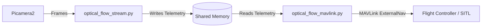

# MAVLink ExternalNav Publisher for Optical Flow

`optical_flow_mavlink.py` is a high-performance bridge utility designed to read integrated 2D position and physical velocity data from the custom `"optical_flow_stream"` shared memory segment and inject it to an ArduPilot-based flight controller as an External Navigation / Visual Odometry sensor using the MAVLink `VISION_POSITION_ESTIMATE` and `VISION_SPEED_ESTIMATE` messages.

This allows the flight controller to utilize the custom high-rate computer vision tracker as an ExternalNav source, enabling stable hover (Loiter mode) and autonomous navigation in GPS-denied environments.

---

## Architecture Flow



1. **`optical_flow_stream.py`** processes frames from the camera, estimates dense optical flow using RANSAC, integrates position, and writes telemetry (timestamp, x, y, vx, vy, alt) to the `"optical_flow_stream"` shared memory segment.
2. **`optical_flow_mavlink.py`** reads the latest position, velocity, and altitude values with sub-millisecond overhead.
3. The publisher packs the integrated position (`x` = North, `y` = East in meters) and ground depth (`z` = -alt) into `VISION_POSITION_ESTIMATE` messages.
4. It packs the instantaneous velocities (`vx`, `vy`) into `VISION_SPEED_ESTIMATE` messages.
5. Both messages are sent at a constant high frequency to the flight controller, allowing the EKF3 to fuse them for precise position estimation.

---

## Installation & Requirements

Ensure all necessary dependencies are installed:
```bash
pip install pymavlink
```
*(Note: If running inside the project virtual environment, activate it or run using `.\venv\Scripts\python.exe`)*

---

## Command Line Usage

Run the script from the root of the project directory:

```bash
python optical_flow_mavlink.py [options]
```

### Options

| Argument | Type | Default | Description |
|---|---|---|---|
| `--connection` | `str` | `udpin:127.0.0.1:14551` | MAVLink connection string (e.g., serial port or UDP endpoint). |
| `--rate` | `float` | `15.0` | Target publishing rate in Hz. |
| `--freshness` | `float` | `0.75` | Maximum age in seconds for a shared memory sample to be considered fresh. |

### Examples

**Inject ExternalNav data at 15Hz to local SITL:**
```bash
python optical_flow_mavlink.py --connection udpin:127.0.0.1:14551 --rate 15
```

**Inject ExternalNav data on a serial companion computer connection:**
```bash
python optical_flow_mavlink.py --connection /dev/ttyAMA0 --rate 20
```

---

## ArduPilot Configuration for Loiter Mode

To enable stable Loiter mode using this ExternalNav stream, set the following parameters on the flight controller:

1. **Enable Visual Odometry (MAVLink):**
   * **`VISO_TYPE = 1`** (MAVLink)

2. **Configure EKF3 Sources to use ExternalNav:**
   * **`EK3_SRC1_POSXY = 6`** (ExternalNav)
   * **`EK3_SRC1_VELXY = 6`** (ExternalNav)
   * **`EK3_SRC1_POSZ = 1`** (Baro) or **`6`** (ExternalNav)

3. **Reboot the flight controller** after modifying these parameters.

---

## Verification & Testing

### Simulated Dry Run
You can verify the injector operates correctly by using the static ExternalNav injector:
1. Start the static injector:
   ```bash
   python static_gps_injector.py --connection udpin:127.0.0.1:14550 --rate 10 --set-mode LOITER
   ```
2. Open your GCS (e.g., Mission Planner or QGroundControl) and inspect the `VISION_POSITION_ESTIMATE` or `VISION_SPEED_ESTIMATE` status in the MAVLink Inspector to verify active, updating values.
