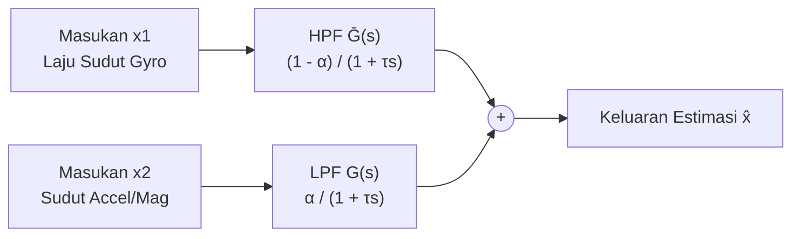
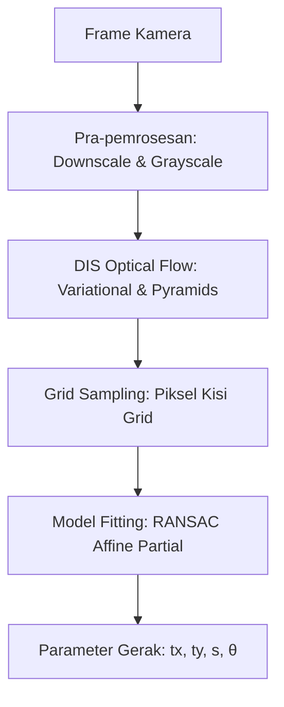
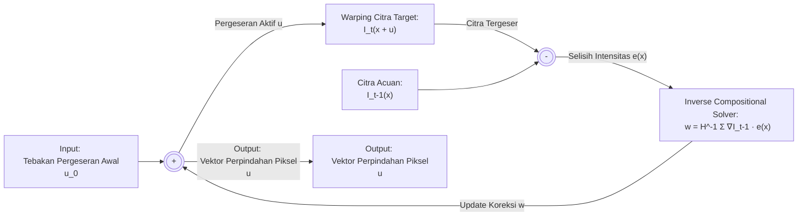
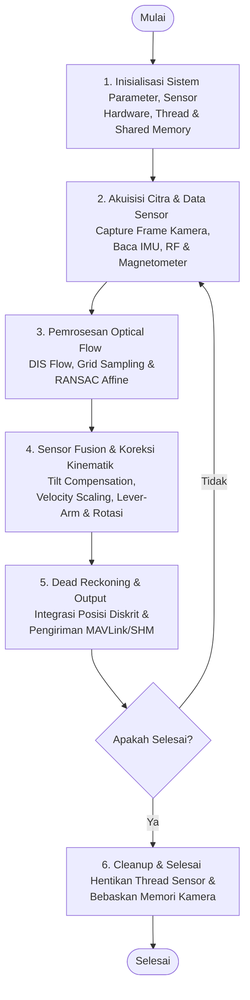

# BAB II: LANDASAN TEORI

## 2.1. Complementary Filter

*Complementary Filter* (CF) merupakan teknik *sensor fusion* yang sangat efisien dari segi komputasi (*computationally inexpensive*), yang terdiri dari sebuah filter lolos-rendah (*low-pass filter* - LPF) dan sebuah filter lolos-tinggi (*high-pass filter* - HPF). Pada penerapannya dalam estimasi sikap (*attitude estimation*) berbasis sensor inersia, karakteristik dinamika gerakan giroskop bersifat komplementer (saling melengkapi) terhadap karakteristik akselerometer dan magnetometer [1]. 

Struktur dasar dari *Complementary Filter* ditunjukkan pada **Gambar 1**, yang terdiri dari dua masukan yaitu $x_1$ dan $x_2$. Kedua masukan tersebut merupakan sinyal $x$ yang masing-masing telah terkontaminasi oleh derau frekuensi tinggi dan frekuensi rendah. Keluaran dari filter, yang dilambangkan dengan $\hat{x}$, dinyatakan dalam domain Laplace melalui **Persamaan (1)** [1]:

$$\hat{x}(s) = x_1(s) \overline{G}(s) + x_2(s) G(s)$$

Keterangan:
* $G(s)$ = fungsi transfer (*transfer function*) untuk filter lolos-rendah (LPF).
* $\overline{G}(s)$ = fungsi transfer untuk filter lolos-tinggi (HPF).
* Kedua fungsi transfer tersebut bersifat komplementer sehingga memenuhi hubungan: $G(s) + \overline{G}(s) = 1$.


<p align="center"><b>Gambar 1.</b> Struktur dasar Complementary Filter (Adaptasi dari [1]).</p>

---

### 2.1.1. Formulasi Estimasi Sikap Linear

Berdasarkan struktur tersebut, untuk melakukan estimasi sikap wahana, estimasi kecepatan sudut dari giroskop ($\dot{x}_g$ atau $[\dot{\phi}, \dot{\theta}, \dot{\psi}]^T$) diterapkan pada masukan HPF ($x_1$), sedangkan hasil estimasi kemiringan dari akselerometer/magnetometer ($x_a$ atau $[\phi_a, \theta_a, \psi_m]^T$) diterapkan pada masukan LPF ($x_2$). 

Secara analitis dalam domain waktu kontinu, estimasi sikap yang dihasilkan melalui struktur *Linear Complementary Filter* (LCF) dinyatakan dalam **Persamaan (2)** [1]:

$$\hat{x} = \alpha \left( \int \dot{x}_g dt \right) + (1 - \alpha) x_a$$

Keterangan:
* $\hat{x}$ = sudut sikap hasil estimasi akhir.
* $\dot{x}_g$ = laju sudut yang diukur oleh giroskop.
* $x_a$ = sudut referensi dari akselerometer/magnetometer.
* $\alpha$ = parameter bobot penyaringan (*weighing factor*) dalam rentang $[0, 1]$ yang menentukan derajat kepercayaan terhadap integrasi giroskop dibanding referensi akselerometer/magnetometer.

#### Implementasi Kode Program Python:
Berikut adalah potongan kode program pada file [sensor_readers.py](file:///e:/OptFlowDrone/OpticalFlowDrone/optical_flow/sensor_readers.py#L328-L356) yang mengimplementasikan integrasi giroskop dan blending complementary filter di atas:
```python
# 1. Integrasi laju giroskop terhadap interval waktu dt (Persamaan 2 - Kiri)
roll_gyro_deg = attitude_state["roll_deg"] + (xgyro_dps * dt)
pitch_gyro_deg = attitude_state["pitch_deg"] + (ygyro_dps * dt)
yaw_gyro_deg = attitude_state["yaw_deg"] + (zgyro_dps * dt)

# 2. Blending Complementary Filter sikap (Persamaan 2 - Fusion)
attitude_state["roll_deg"] = normalize_angle_deg(
    (COMPLEMENTARY_FILTER_ALPHA * roll_gyro_deg)
    + ((1.0 - COMPLEMENTARY_FILTER_ALPHA) * roll_accel_deg)
)
attitude_state["pitch_deg"] = normalize_angle_deg(
    (COMPLEMENTARY_FILTER_ALPHA * pitch_gyro_deg)
    + ((1.0 - COMPLEMENTARY_FILTER_ALPHA) * pitch_accel_deg)
)
```

---

### 2.1.2. Representasi Fungsi Transfer Domain Laplace

Estimasi LCF dalam representasi fungsi transfer domain Laplace s-domain dapat dijabarkan melalui hubungan matematis pada **Persamaan (3)** [1]:

$$\hat{x}(s) = \frac{\tau s}{1 + \tau s} \left( \frac{\dot{x}_g(s)}{s} \right) + \frac{1}{1 + \tau s} x_a(s)$$

Keterangan:
* $\tau$ = konstanta waktu filter (*filter time constant*).
* $s$ = variabel kompleks Laplace.
* $\frac{\dot{x}_g(s)}{s}$ = representasi integrasi laju giroskop dalam domain frekuensi (karena integrasi $\int dt$ setara dengan pembagian $\frac{1}{s}$ di domain Laplace).

Melalui formulasi tersebut, fungsi transfer individu dari HPF dan LPF pada penyaring komplementer linear diidentifikasi sebagai:

$$\text{LCF\_HPF}(s) = \frac{\tau s}{1 + \tau s}$$

$$\text{LCF\_LPF}(s) = \frac{1}{1 + \tau s}$$

Pola tanggapan amplitudo (*amplitude*) dan fase (*phase*) dari gabungan fungsi transfer ini menghasilkan nilai magnitudo konstan sebesar unity (0 dB) serta pergeseran fase 0 derajat di seluruh rentang frekuensi operasionalnya. Hal ini memastikan bahwa sinyal sikap yang dilewati filter tidak mengalami distorsi redaman ataupun keterlambatan fase (*phase lag*) yang signifikan [1].

---

## 2.2. Optical Flow dan Model Gerak Affine

*Optical Flow* (Aliran Optik) didefinisikan sebagai pola gerakan semu dari objek, tepi, dan batas dalam suatu adegan visual yang disebabkan oleh gerakan relatif antara pengamat (kamera) dan adegan tersebut [2], [3]. Pada wahana tanpa awak (UAV), estimasi *optical flow* digunakan untuk mengukur kecepatan linier horizontal wahana terhadap permukaan tanah.

Secara umum, proses pemrosesan aliran optik pada sistem ditunjukkan pada **Gambar 2**, yang menggambarkan alur penangkapan citra dari kamera hingga ekstraksi parameter gerakan.


<p align="center"><b>Gambar 2.</b> Diagram alir pemrosesan Optical Flow dan ekstraksi parameter gerak.</p>

Setiap titik koordinat piksel pada citra diasumsikan memenuhi **Asumsi Konsistensi Kecerahan (*Brightness Constancy Assumption*)** [2] yang didefinisikan melalui **Persamaan (4)** [2]:

$$I_{t-1}(\mathbf{x}) = I_t(\mathbf{x} + \mathbf{u})$$

Keterangan:
* $I_{t-1}$ = intensitas citra pada bingkai waktu sebelumnya ($t-1$).
* $I_t$ = intensitas citra pada bingkai waktu aktif ($t$).
* $\mathbf{x}$ = koordinat piksel $[x, y]^T$ pada citra.
* $\mathbf{u}$ = vektor pergeseran $[u, v]^T$ yang dicari.

---

### 2.2.1. Dense Inverse Search (DIS) Optical Flow
Dibandingkan dengan metode estimasi aliran optik berbasis titik fitur (*sparse feature tracking* seperti Lucas-Kanade [4]), penelitian ini menggunakan algoritma **Dense Inverse Search (DIS) Optical Flow** [5]. Algoritma DIS dirancang khusus untuk komputasi berkecepatan tinggi pada perangkat keras dengan keterbatasan sumber daya (*resource-constrained*) seperti Raspberry Pi.

Algoritma DIS membagi pemrosesan citra ke dalam struktur piramida multi-skala (*coarse-to-fine*) untuk melacak gerakan besar dan kecil secara efisien. Pada setiap level skala, tugas pelacakan didefinisikan sebagai pencocokan blok piksel lokal (*patch matching*) yang meminimalkan kriteria kuadrat terkecil perbedaan intensitas (*sum of squared differences* - SSD) citra melalui **Persamaan (5)** [5]:

$$E(\mathbf{w}) = \sum_{\mathbf{x} \in \Omega} \left[ I_t(\mathbf{x} + \mathbf{u}) - I_{t-1}(\mathbf{x} + \mathbf{w}) \right]^2$$

Keterangan:
* $E(\mathbf{w})$ = energi kesalahan kuadrat intensitas piksel *patch*.
* $\Omega$ = domain piksel lokal di dalam area *patch* (ukuran $8 \times 8$ piksel).
* $\mathbf{u}$ = vektor pergeseran estimasi awal.
* $\mathbf{w}$ = vektor pembaruan pergeseran (*incremental warp update*) pada citra acuan.

Optimasi pencarian nilai $\mathbf{w}$ diselesaikan menggunakan metode **Inverse Compositional (IC)**. Melalui ekspansi deret Taylor orde pertama pada citra acuan $I_{t-1}$, nilai koreksi $\mathbf{w}$ diturunkan secara iteratif hingga konvergen melalui perumusan linear pada **Persamaan (6)** [5]:

$$\mathbf{w} = H^{-1} \sum_{\mathbf{x} \in \Omega} \nabla I_{t-1}(\mathbf{x}) \left[ I_t(\mathbf{x} + \mathbf{u}) - I_{t-1}(\mathbf{x}) \right]$$

Keterangan:
* $\nabla I_{t-1}(\mathbf{x})$ = gradien spasial intensitas citra acuan pada posisi $\mathbf{x}$.
* $H$ = matriks Hessian sistem berukuran $2 \times 2$ yang didefinisikan sebagai:
  $$H = \sum_{\mathbf{x} \in \Omega} \nabla I_{t-1}(\mathbf{x}) \nabla I_{t-1}(\mathbf{x})^T$$

Karena gradien $\nabla I_{t-1}$ dan matriks Hessian $H$ dievaluasi pada citra acuan statis $I_{t-1}$ (di mana $\mathbf{w} = \mathbf{0}$), keduanya bernilai **konstan** dan hanya perlu dihitung **sekali saja** sebelum iterasi dimulai. Setelah $\mathbf{w}$ diperoleh pada setiap langkah iteratif, estimasi pergeseran diperbarui secara komposisi: $\mathbf{u} \leftarrow \mathbf{u} - \mathbf{w}$.

#### Implementasi Kode Program Python:
Berikut adalah pemanggilan fungsi OpenCV DIS Optical Flow untuk kalkulasi aliran optik padat (Persamaan 5 & 6) pada file [flow_processor.py](file:///e:/OptFlowDrone/OpticalFlowDrone/optical_flow/flow_processor.py#L40-L55):
```python
# Inisialisasi estimator DIS Flow dengan preset ULTRAFAST
dis_flow = cv2.DISOpticalFlow_create(cv2.DISOPTICAL_FLOW_PRESET_ULTRAFAST)

# Kalkulasi pergeseran aliran optik padat (Persamaan 5 & 6)
flow = dis_flow.calc(old_gray, frame_gray, None)
```

Setelah peta aliran optik padat untuk seluruh piksel gambar diperoleh, kisi grid disampel menggunakan interval langkah ($step$) tertentu melalui **Persamaan (7)** [5]:

$$P_{\text{old}} = (x_i, y_i) \quad \text{dan} \quad P_{\text{new}} = (x_i + u(x_i, y_i), \ y_i + v(x_i, y_i))$$

Keterangan:
* $P_{\text{old}}$ = koordinat awal kisi grid piksel sebelum bergerak.
* $P_{\text{new}}$ = koordinat proyeksi kisi grid piksel baru setelah bergerak.
* $u(x_i, y_i)$ = pergeseran piksel horizontal hasil perhitungan DIS pada koordinat sampling.
* $v(x_i, y_i)$ = pergeseran piksel vertikal hasil perhitungan DIS pada koordinat sampling.

#### Implementasi Kode Program Python:
Langkah sampling koordinat grid dan perolehan titik korespondensi diimplementasikan pada file [flow_processor.py](file:///e:/OptFlowDrone/OpticalFlowDrone/optical_flow/flow_processor.py#L57-L66):
```python
# Kisi grid koordinat dengan langkah sampling step = 8 piksel
ys, xs = np.mgrid[step//2:h:step, step//2:w:step].astype(np.float32)
P_old = np.stack((xs, ys), axis=-1).reshape(-1, 2)

# Mengambil vektor pergeseran (u, v) dari matriks flow di posisi grid
u = flow[ys.astype(int), xs.astype(int), 0]
v = flow[ys.astype(int), xs.astype(int), 1]
flow_vectors = np.stack((u, v), axis=-1).reshape(-1, 2)
P_new = P_old + flow_vectors
```

---

### 2.2.2. Model Affine Partial 2D dan RANSAC

Untuk menyatukan ribuan vektor perpindahan piksel hasil sampling DIS menjadi estimasi gerakan tunggal kamera drone, diterapkan kombinasi antara pemodelan matematika geometris dan algoritma estimasi robust. Bagian ini dibagi menjadi tiga tahapan utama:

#### A. Model Geometri Affine Partial 2D
Model geometri **Affine Partial 2D** (juga dikenal sebagai transformasi *Similarity*) digunakan untuk merepresentasikan hubungan pergeseran antara dua bingkai citra berurutan dengan asumsi bahwa permukaan tanah di bawah drone berupa bidang datar. Model ini memiliki **4 derajat kebebasan (*degrees of freedom* - DoF)**, yaitu: translasi horizontal ($t_x$), translasi vertikal ($t_y$), penskalaan seragam ($s$), dan rotasi bidang citra ($\theta$).

Hubungan transformasi koordinat piksel lama ($P_{\text{old}}$) dan koordinat piksel baru ($P_{\text{new}}$) dinyatakan melalui matriks transformasi linear pada **Persamaan (8)** [6]:

$$\begin{bmatrix} x_{\text{new}} \\ y_{\text{new}} \end{bmatrix} = \begin{bmatrix} s \cos\theta & -s \sin\theta \\ s \sin\theta & s \cos\theta \end{bmatrix} \begin{bmatrix} x_{\text{old}} \\ y_{\text{old}} \end{bmatrix} + \begin{bmatrix} t_x \\ t_y \end{bmatrix}$$

Keterangan:
* $t_x$ = translasi pergeseran piksel horizontal kamera.
* $t_y$ = translasi pergeseran piksel vertikal kamera.
* $s$ = faktor skala perubahan ukuran citra seragam (berkorelasi dengan naik/turunnya ketinggian drone).
* $\theta$ = sudut rotasi kemiringan bidang citra (berkorelasi dengan pergerakan putaran yaw drone).

---

#### B. The Location Determination Problem (LDP)
Penentuan posisi dan orientasi kamera drone dari korespondensi titik aliran optik merupakan variasi dua dimensi (2D) dari **Location Determination Problem (LDP)** yang dirumuskan oleh Fischler dan Bolles [6]. LDP didefinisikan secara formal sebagai masalah penentuan lokasi (translasi) dan sikap/orientasi (rotasi) dari sebuah sensor (dalam hal ini kamera) relatif terhadap sistem koordinat acuan menggunakan sekumpulan pengamatan koordinat titik fitur. 

Pada implementasi proyek ini, permasalahan LDP diselesaikan untuk mencari pergerakan relatif kamera horizontal antara waktu $t-1$ dan $t$. Tantangan utama penyelesaian LDP dalam skenario dunia nyata adalah kehadiran data pencocokan salah (**outliers**) yang masif. Data salah ini umumnya diakibatkan oleh perubahan intensitas bayangan drone, gerakan tanaman atau rumput akibat tiupan angin dari baling-baling drone (*downwash*), serta derau spasial sensor kamera. 

Jika permasalahan LDP diselesaikan secara langsung menggunakan metode estimasi kuadrat terkecil konvensional (*Ordinary Least Squares*), keberadaan *outliers* tersebut akan merusak estimasi posisi drone secara drastis karena metode tersebut meminimalkan galat dari seluruh data tanpa membedakan data benar (*inliers*) dan data salah (*outliers*).

---

#### C. Algoritma RANSAC (Random Sample Consensus)
Untuk mengatasi kelemahan penyelesaian LDP di atas, diterapkan algoritma **RANSAC** [6]. Filosofi RANSAC adalah menyelesaikan LDP dengan menggunakan jumlah sampel titik minimum ($n$) yang paling krusial untuk mengestimasi model awal. Dengan meminimalkan ukuran sampel initial, probabilitas terpilihnya sampel yang bebas dari *outliers* akan meningkat secara teoritis. 

Pada model geometri *Affine Partial 2D* yang memiliki 4 derajat kebebasan, jumlah sampel minimum yang dibutuhkan adalah **$n = 2$ pasang titik korespondensi** (karena setiap pasang koordinat 2D memberikan 2 persamaan independen, menghasilkan total 4 persamaan untuk menyelesaikan 4 parameter tidak diketahui).

Cara kerja RANSAC pada kode program adalah sebagai berikut:
1. **Sampling Acak**: Memilih secara acak subset sampel minimum sebanyak $n = 2$ pasang titik koordinat ($P_{\text{old}}$ dan $P_{\text{new}}$) dari data sampling DIS untuk mengestimasi parameter model awal.
2. **Konsensus**: Mengevaluasi model awal terhadap seluruh sisa titik korespondensi lainnya berdasarkan batas toleransi reproyeksi tertentu (`ransacReprojThreshold = 2.0` piksel). Titik yang memiliki galat proyeksi di bawah ambang batas dikategorikan sebagai *inliers* (himpunan konsensus), sedangkan sisanya didefinisikan sebagai *outliers*.
3. **Iterasi**: Mengulangi proses sampling dan konsensus selama sejumlah iterasi maksimum. Model dengan jumlah *inliers* terbanyak (konsensus terbesar) dipilih sebagai solusi LDP akhir, dan seluruh *inliers* dalam himpunan konsensus terbaik tersebut dipasang kembali menggunakan estimasi kuadrat terkecil untuk mendapatkan hasil presisi.

Setelah matriks konsensus terbaik $M$ diperoleh, parameter translasi dan rotasi makroskopis kamera diekstraksi menggunakan perumusan pada **Persamaan (9)** [6]:

$$t_x = M_{0, 2}, \quad t_y = M_{1, 2}, \quad s = \sqrt{M_{0, 0}^2 + M_{1, 0}^2}, \quad \text{dan} \quad \theta = \operatorname{atan2}(M_{1, 0}, M_{0, 0})$$

Keterangan:
* $M$ = matriks transformasi affine hasil estimasi RANSAC.
* $M_{i, j}$ = elemen matriks pada baris ke-i dan kolom ke-j.

##### Implementasi Kode Program Python:
Estimasi matriks transformasi menggunakan RANSAC serta ekstraksi parameter gerakan di atas diimplementasikan pada file [flow_processor.py](file:///e:/OptFlowDrone/OpticalFlowDrone/optical_flow/flow_processor.py#L77-L95):
```python
# 1. RANSAC untuk memisahkan inliers dan mengestimasi model geometri (Persamaan 8)
affine_result = cv2.estimateAffinePartial2D(old_filtered, new_filtered, method=cv2.RANSAC, ransacReprojThreshold=2.0)
M, inlier_mask = affine_result

# 2. Ekstraksi parameter gerak dari matriks M (Persamaan 9)
tx = float(M[0, 2])
ty = float(M[1, 2])
scale = float(math.sqrt(M[0, 0]**2 + M[1, 0]**2))
theta = float(math.atan2(M[1, 0], M[0, 0]))
```

---

## 2.3. Sensor Fusion, Kompensasi Kemiringan, dan Dead Reckoning

Untuk memperoleh koordinat posisi $X$ dan $Y$ absolut drone yang akurat dalam ruang navigasi lokal, sistem menggabungkan (*fuse*) data dari berbagai sensor fisik. Arsitektur diagram blok aliran data keseluruhan sistem ditunjukkan pada **Gambar 3**.

```mermaid
graph LR
    %% Jalur Utama (Atas: Kiri ke Kanan)
    Cam["Kamera Downward"] --> OF["DIS Optical Flow"]
    OF -->|"Aliran Piksel"| Grid["Grid Sampling"]
    Grid -->|"Korespondensi"| RANSAC["RANSAC Affine 2D"]
    
    RANSAC -->|"t_x, t_y"| SumTilt((( + / - )))
    
    SumTilt -->|"t_x_comp, t_y_comp"| Scale["Physical Velocity Scaling"]
    Scale -->|"V_x_body, V_y_body"| SumLever((( + / - )))
    
    SumLever -->|"V_x_body_comp, V_y_body_comp"| Rot["Coordinate Rotation"]
    Rot -->|"V_x_world, V_y_world"| Integ["Dead Reckoning Integrator"]
    Integ -->|"X_world, Y_world"| Pos["Posisi Absolut Drone"]
    
    %% Jalur Kompensasi Kemiringan (Bawah Kiri)
    IMU_G["IMU: Giroskop"] --> CF["Complementary Filter"]
    IMU_A["IMU: Akselerometer"] --> CF
    CF -->|"Sikap: ϕ, θ"| TiltCalc["Tilt Projection <br> (Kompensasi Kemiringan)"]
    TiltCalc -->|"d_reticle"| SumTilt
    
    %% Sensor Ketinggian
    RF["Rangefinder (Ketinggian h)"] --> Scale
    
    %% Jalur Koreksi Jarak Kamera (Bawah Tengah)
    IMU_G -->|"Laju Yaw: ω_z"| LeverCalc["Lever-Arm Calculator"]
    LeverCalc -->|"v_offset"| SumLever
    
    %% Sensor Magnetometer
    Mag["Magnetometer (Heading ψ)"] --> Rot
```


<p align="center"><b>Gambar 3.</b> Diagram blok sistem sensor fusion, kompensasi kemiringan, dan dead reckoning dalam bentuk sistem kontrol open-loop estimator.</p>

Di dalam modul *Optical Flow* itu sendiri (khususnya pada algoritma DIS dengan optimasi *Inverse Compositional*), terdapat sistem lingkar tertutup (*closed-loop*) matematis secara internal untuk menyelesaikan estimasi pergeseran blok piksel citra (*patch matching*) secara iteratif. Diagram blok closed-loop internal modul *optical flow* ini ditunjukkan pada **Gambar 4**.


<p align="center"><b>Gambar 4.</b> Diagram blok kontrol loop tertutup (closed-loop) internal optimasi algoritma DIS Optical Flow.</p>

---

### 2.3.1. Kompensasi Sudut Kemiringan (Tilt Compensation)
Pergerakan rotasi dinamis drone pada sumbu Roll ($\phi$) dan Pitch ($\theta$) menghasilkan efek pergeseran piksel semu (*apparent flow*) pada lensa kamera meskipun drone sedang tidak bergeser secara lateral. Hal ini dieliminasi dengan memproyeksikan delta perubahan orientasi sudut sejak frame sebelumnya ($\Delta\phi$ dan $\Delta\theta$) menjadi pergeseran piksel ekspektasi melalui **Persamaan (10)** [3]:

$$d_{\text{reticle}, x} = (\phi_t - \phi_{t-1}) \cdot K_{\text{roll}} \quad \text{dan} \quad d_{\text{reticle}, y} = -(\theta_t - \theta_{t-1}) \cdot K_{\text{pitch}}$$

Keterangan:
* $d_{\text{reticle}, x}$ = estimasi pergeseran piksel sumbu-x akibat kemiringan Roll.
* $d_{\text{reticle}, y}$ = estimasi pergeseran piksel sumbu-y akibat kemiringan Pitch.
* $K_{\text{roll}}, K_{\text{pitch}}$ = konstanta kalibrasi rasio piksel terhadap derajat kemiringan.

Nilai pergeseran sudut terproyeksi kemudian dikurangkan dari nilai pergeseran citra mentah ($t_x, t_y$) untuk memperoleh translasi murni kamera melalui **Persamaan (11)** [3]:

$$t_{x, \text{compensated}} = t_x - (\text{scale}_x \cdot d_{\text{reticle}, x}) \quad \text{dan} \quad t_{y, \text{compensated}} = t_y - (\text{scale}_y \cdot d_{\text{reticle}, y})$$

Keterangan:
* $t_{x, \text{compensated}}$ = perpindahan piksel horizontal terkompensasi.
* $t_{y, \text{compensated}}$ = perpindahan piksel vertikal terkompensasi.
* $\text{scale}_x, \text{scale}_y$ = parameter sensitivitas kalibrasi kompensasi.

#### Implementasi Kode Program Python:
Kompensasi kemiringan dinamik ini diimplementasikan di dalam file [flow_processor.py](file:///e:/OptFlowDrone/OpticalFlowDrone/optical_flow/flow_processor.py#L143-L151) sebagai berikut:
```python
# Menghitung estimasi pergeseran piksel semu akibat kemiringan (Persamaan 10)
d_reticle_x = roll_px - prev_roll_px
d_reticle_y = pitch_px - prev_pitch_px

# Kompensasi sudut kemiringan pada translasi optical flow (Persamaan 11)
tx_comp = tx - (scale_x * d_reticle_x)
ty_comp = ty - (scale_y * d_reticle_y)
```

---

### 2.3.2. Penskalaan Kecepatan Fisik (Physical Velocity Scaling)
Konversi pergeseran piksel terkompensasi menjadi kecepatan linier fisik dalam koordinat lokal tubuh drone (*body-frame* velocity dalam m/s) memerlukan data ketinggian ($h$) dari sensor jarak melalui **Persamaan (12)** [3]:

$$V_{x, \text{body}} = \frac{t_{x, \text{compensated}} \cdot h}{f_x \cdot dt} \quad \text{dan} \quad V_{y, \text{body}} = -\frac{t_{y, \text{compensated}} \cdot h}{f_y \cdot dt}$$

Keterangan:
* $V_{x, \text{body}}$ = kecepatan translasi tubuh drone pada sumbu-x (maju/mundur).
* $V_{y, \text{body}}$ = kecepatan translasi tubuh drone pada sumbu-y (kiri/kanan).
* $h$ = ketinggian vertikal drone di atas permukaan tanah (meter).
* $f_x, f_y$ = panjang fokus lensa kamera dalam piksel.
* $dt$ = interval waktu pemrosesan antar bingkai citra (detik).

#### Implementasi Kode Program Python:
Penskalaan dari dimensi piksel ke dimensi metrik fisik (Persamaan 12) diimplementasikan pada file [flow_processor.py](file:///e:/OptFlowDrone/OpticalFlowDrone/optical_flow/flow_processor.py#L153-L158):
```python
# Konversi translasi piksel terkompensasi menjadi kecepatan fisik (m/s)
vx_mps_body = ((tx_comp * altitude_m) / (focal_length_x_px * dt_s))
vy_mps_body = -((ty_comp * altitude_m) / (focal_length_y_px * dt_s))
```

---

### 2.3.3. Koreksi Jarak Kamera (Lever-Arm Offset Correction)
Jika kamera tidak dipasang tepat di pusat rotasi gravitasi drone, setiap putaran sudut yaw ($\omega_z$) drone akan menghasilkan gaya gerak translasi palsu pada sensor kamera. Koreksi efek tuas (*lever-arm offset*) dihitung berdasarkan kecepatan rotasi yaw dalam **Persamaan (13)** [7]:

$$v_{\text{offset}, x} = -\omega_z \cdot \left(\frac{C_y}{100}\right) \quad \text{dan} \quad v_{\text{offset}, y} = \omega_z \cdot \left(\frac{C_x}{100}\right)$$

Keterangan:
* $v_{\text{offset}, x}, v_{\text{offset}, y}$ = kecepatan translasi induksi akibat rotasi yaw (m/s).
* $C_x, C_y$ = koordinat fisik letak kamera terhadap pusat gravitasi drone (cm).
* $\omega_z$ = kecepatan sudut putaran yaw drone (radian/detik).

Kecepatan tubuh drone yang terkoreksi secara penuh dari efek gerak translasi semu dirumuskan dalam **Persamaan (14)** [7]:

$$V_{x, \text{body, comp}} = V_{x, \text{body}} - v_{\text{offset}, x} \quad \text{dan} \quad V_{y, \text{body, comp}} = V_{y, \text{body}} - v_{\text{offset}, y}$$

Keterangan:
* $V_{x, \text{body, comp}}, V_{y, \text{body, comp}}$ = kecepatan tubuh drone terkoreksi akhir.

#### Implementasi Kode Program Python:
Koreksi tuas kamera (lever-arm offset) ini diimplementasikan di dalam file [flow_processor.py](file:///e:/OptFlowDrone/OpticalFlowDrone/optical_flow/flow_processor.py#L160-L167):
```python
# Koreksi lever-arm offset akibat rotasi yaw (Persamaan 13)
yaw_rate_rad = math.radians(zgyro_dps)
v_offset_x = -yaw_rate_rad * (camera_offset_y / 100.0)
v_offset_y = yaw_rate_rad * (camera_offset_x / 100.0)

# Kecepatan linier tubuh drone terkoreksi akhir (Persamaan 14)
vx_mps_body_comp = vx_mps_body - v_offset_x
vy_mps_body_comp = vy_mps_body - v_offset_y
```

---

### 2.3.4. Rotasi Bingkai Koordinat & Integrasi Posisi (Dead Reckoning)
Kecepatan linear tubuh drone ($V_{x, \text{body, comp}}, V_{y, \text{body, comp}}$) diputar menuju koordinat global bumi (Timur/Utara) menggunakan data sudut yaw absolut ($\psi$) dari kompas berdasarkan **Persamaan (15)** [7]:

$$V_{x, \text{world}} = V_{x, \text{body, comp}} \cdot \cos(\psi) + V_{y, \text{body, comp}} \cdot \sin(\psi)$$

$$V_{y, \text{world}} = -V_{x, \text{body, comp}} \cdot \sin(\psi) + V_{y, \text{body, comp}} \cdot \cos(\psi)$$

Keterangan:
* $V_{x, \text{world}}, V_{y, \text{world}}$ = kecepatan gerak drone pada koordinat absolut bumi (m/s).
* $\psi$ = sudut heading kompas dalam radian.

Selanjutnya, kecepatan bumi diintegrasikan secara diskrit terhadap waktu untuk melacak perpindahan jarak linier absolut ($x_{\text{world}}, y_{\text{world}}$) drone melalui **Persamaan (16)** [7]:

$$x_{\text{world}, t} = x_{\text{world}, t-1} + V_{x, \text{world}} \cdot dt \quad \text{dan} \quad y_{\text{world}, t} = y_{\text{world}, t-1} + V_{y, \text{world}} \cdot dt$$

Keterangan:
* $x_{\text{world}, t}, y_{\text{world}, t}$ = koordinat posisi absolut drone saat ini (meter).

#### Implementasi Kode Program Python:
Rotasi kecepatan ke koordinat dunia serta integrasi posisi akumulatif (dead reckoning) diimplementasikan pada file [flow_processor.py](file:///e:/OptFlowDrone/OpticalFlowDrone/optical_flow/flow_processor.py#L169-L180):
```python
# 1. Rotasi kecepatan linier tubuh ke koordinat bumi (Persamaan 15)
vx_mps_calc = vx_mps_body_comp * cos_yaw + vy_mps_body_comp * sin_yaw
vy_mps_calc = -vx_mps_body_comp * sin_yaw + vy_mps_body_comp * cos_yaw

# 2. Integrasi posisi absolut secara diskrit (Persamaan 16)
position_state["x_cm"] += vx_mps * 100.0 * dt_s
position_state["y_cm"] += vy_mps * 100.0 * dt_s
```


---

## 2.4. Diagram Alir Proses Sistem (System Flowchart)

Aktivitas eksekusi sistem estimasi posisi drone berbasis *optical flow* dan *sensor fusion* secara ringkas diilustrasikan melalui **Gambar 5**.


<p align="center"><b>Gambar 5.</b> Diagram alir (flowchart) ringkas eksekusi sistem.</p>

---

## Referensi

[1] P. Narkhede, S. Poddar, R. Walambe, G. Ghinea, and K. Kotecha, "Cascaded Complementary Filter Architecture for Sensor Fusion in Attitude Estimation," *Sensors*, vol. 21, no. 6, p. 1937, 2021.

[2] D. Fortun, P. Bouthemy, and C. Kervrann, "Optical flow modeling and computation: A survey," *Computer Vision and Image Understanding*, vol. 134, pp. 1-21, 2015.

[3] H. Chao, Y. Gu, and M. Napolitano, "A survey of optical flow techniques for UAV navigation," in *Proceedings of the 2014 International Conference on Unmanned Aircraft Systems (ICUAS)*, 2014, pp. 510-516.

[4] B. D. Lucas and T. Kanade, "An Iterative Image Registration Technique with an Application to Stereo Vision," in *Proceedings of the 7th International Joint Conference on Artificial Intelligence (IJCAI)*, 1981, pp. 674-679.

[5] T. Kroeger, R. Timofte, D. Dai, and L. Van Gool, "Fast Optical Flow using Dense Inverse Search," in *Proceedings of the European Conference on Computer Vision (ECCV)*, 2016, pp. 471-488.

[6] M. A. Fischler and R. C. Bolles, "Random Sample Consensus: A Paradigm for Model Fitting with Applications to Image Analysis and Automated Cartography," *Communications of the ACM*, vol. 24, no. 6, pp. 381-395, 1981.

[7] J. A. Farrell, *Aided Navigation: GPS with High Rate Sensors*. New York, NY, USA: McGraw-Hill, Inc., 2008.
