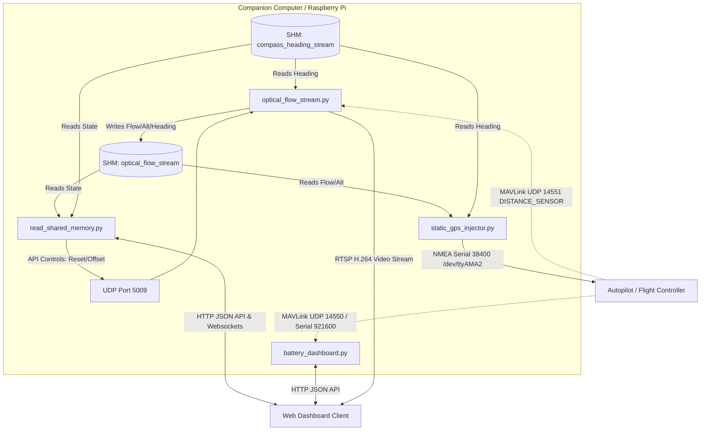

# Data Communication Architecture

This document describes the data communication channels, protocols, and interfaces used in the **Optical Flow Drone** project. The communication architecture ranges from low-level hardware serial links to inter-process shared memory and high-level HTTP APIs.



---

## 1. Inter-Process Communication (IPC) via Shared Memory

To achieve high-rate, low-latency communication between independent scripts running on the Raspberry Pi, the system uses Python `multiprocessing.shared_memory` segments.

### A. Optical Flow Stream Memory (`optical_flow_stream`)
* **Writer:** [optical_flow_stream.py](file:///e:/OptFlowDrone/OpticalFlowDrone/optical_flow_stream.py)
* **Readers:** [static_gps_injector.py](file:///e:/OptFlowDrone/OpticalFlowDrone/static_gps_injector.py) and [read_shared_memory.py](file:///e:/OptFlowDrone/OpticalFlowDrone/read_shared_memory.py)
* **Data Layout:** A circular ring buffer structure designed to handle high-frequency writes without thread blocking.
  * **Header Format (`<4sII`):** Magic string (`"FLOW"`), Write Index (uint32), Sample Count (uint32).
  * **Record Format (`<11d`):** Timestamp, $X_{\text{cm}}$, $Y_{\text{cm}}$, Raw $X_{\text{cm}}$, Raw $Y_{\text{cm}}$, $V_x$, $V_y$, Raw $V_x$, Raw $V_y$, Altitude, Heading.
  * **Buffer Size:** Max 120 samples.

#### Data Example (Parsed Dict representation)
```json
{
  "timestamp": 1729452.48201,
  "x_cm": 152.48,
  "y_cm": -48.21,
  "x_raw_cm": 160.12,
  "y_raw_cm": -52.09,
  "vx": 0.42,
  "vy": -0.15,
  "vx_raw": 0.45,
  "vy_raw": -0.18,
  "alt": 1.48,
  "heading": 124.50
}
```

### B. Compass Stream Memory (`compass_heading_stream`)
* **Reader:** [optical_flow_stream.py](file:///e:/OptFlowDrone/OpticalFlowDrone/optical_flow_stream.py) and [static_gps_injector.py](file:///e:/OptFlowDrone/OpticalFlowDrone/static_gps_injector.py)
* **Data Layout:** 
  * **Header Format (`<4sII`):** Magic string (`"CHDG"`), Write Index (uint32), Sample Count (uint32).
  * **Record Format (`<6d`):** Timestamp, Raw Heading, Smoothed Heading, Magnetometer $X$, Magnetometer $Y$, Magnetometer $Z$.
  * **Buffer Size:** Max 120 samples.

#### Data Example (Parsed Dict representation)
```json
{
  "timestamp": 1729452.48152,
  "raw_heading": 125.12,
  "heading": 124.50,
  "x": 1205.42,
  "y": -3482.10,
  "z": 15092.40
}
```

---

## 2. Flight Controller GPS Telemetry Injection (Serial NMEA)

**File location:** [static_gps_injector.py](file:///e:/OptFlowDrone/OpticalFlowDrone/static_gps_injector.py)

The companion computer injects the fused position and orientation back to ArduPilot/PX4 by acting as a virtual GPS receiver.

* **Interface:** Hardware UART `/dev/ttyAMA2`
* **Settings:** Baud rate **38400**, 8N1.
* **Protocol:** Standard NMEA 0183 sentences. At **10 Hz**, the injector outputs:
  * **`$GPGGA`**: Fuses UTC Time, calculated Latitude, Longitude, RTK Fix Quality ("4"), Satellites ("30"), HDOP ("0.1"), and Rangefinder Altitude.
  * **`$GPRMC`**: Fuses UTC Time, Validity flag, calculated Latitude/Longitude coordinates, Speed, and Track Angle.
  * **`$GPGSA`**: Broadcasts active satellite numbers and precision metrics (PDOP, HDOP, VDOP) to satisfy autopilot validation checks.
  * **`$GPHDT`**: Broadcasts the absolute True Heading from the compass telemetry.

#### Data Example (Transmitted Serial Strings)
```nmea
$GPGGA,034816.00,-0655.050000,S,10737.146000,E,4,30,0.1,1.48,M,0.0,M,,*4A
$GPRMC,034816.00,A,-0655.050000,S,10737.146000,E,0.0,0.0,290626,,,A*72
$GPGSA,A,3,01,02,03,04,05,06,07,08,09,10,,,1.2,0.1,0.9*34
$GPHDT,124.5,T*3E
```

---

## 3. MAVLink Telemetry Streams

* **Connection Strings:** 
  * `udp:127.0.0.1:14551` (Rangefinder data to `optical_flow_stream.py`)
  * `udp:127.0.0.1:14550` or `/dev/serial0` (Battery/Heartbeat telemetry to `battery_dashboard.py`)
* **Details:**
  * Uses the **MAVLink v2** protocol wrapped by `pymavlink`.
  * Allows the companion computer to listen passively to autopilot states (Arm/Disarm checks) and sensor telemetry (rangefinder distances, system health flags, battery state) generated by the flight controller.

#### Data Example (MAVLink Message Object representation)
* **`DISTANCE_SENSOR` Packet:**
  ```json
  {
    "mavpackettype": "DISTANCE_SENSOR",
    "time_boot_ms": 1248092,
    "min_distance": 10,
    "max_distance": 2000,
    "current_distance": 148,
    "type": 0,
    "id": 1,
    "orientation": 25,
    "covariance": 0
  }
  ```
* **`BATTERY_STATUS` Packet:**
  ```json
  {
    "mavpackettype": "BATTERY_STATUS",
    "id": 0,
    "battery_function": 1,
    "type": 3,
    "temperature": 3200,
    "voltages": [11240, 65535, 65535, 65535, 65535, 65535, 65535, 65535, 65535, 65535],
    "current_battery": 240,
    "current_consumed": 450,
    "energy_consumed": -1,
    "battery_remaining": 88
  }
  ```

---

## 4. Local Loopback UDP Commands

* **Interface:** Local UDP loopback (`127.0.0.1:5009`)
* **Details:**
  * Used to send real-time commands from Web Dashboard processes directly to the core camera processing loop.

#### Data Example (Transmitted UDP commands)
* **Reset accumulated coordinates:**
  ```
  reset
  ```
* **Update camera installation offsets:**
  ```
  offset 5.0 -2.0
  ```

---

## 5. Web Interface and APIs

* **Server:** Flask micro-framework
* **Endpoints:**
  * `POST /api/opticalflow/reset`: Calls local UDP loopback to trigger position reset.
  * `POST /api/opticalflow/offset`: Submits updated physical camera offset settings.
  * `GET /api/shm/config`: Exposes shared memory layouts and registry keys.

#### Data Example (HTTP Payload and Response JSON)
* **`POST /api/opticalflow/offset` Request Body:**
  ```json
  {
    "offset_x": 5.0,
    "offset_y": -2.0
  }
  ```
* **`POST /api/opticalflow/offset` Response Body:**
  ```json
  {
    "success": true,
    "offset_x": 5.0,
    "offset_y": -2.0
  }
  ```
* **`GET /api/shm/config` Response Body:**
  ```json
  {
    "optical_flow_stream": {
      "magic": "FLOW",
      "header_format": "<4sII",
      "record_format": "<11d",
      "max_samples": 120
    }
  }
  ```
