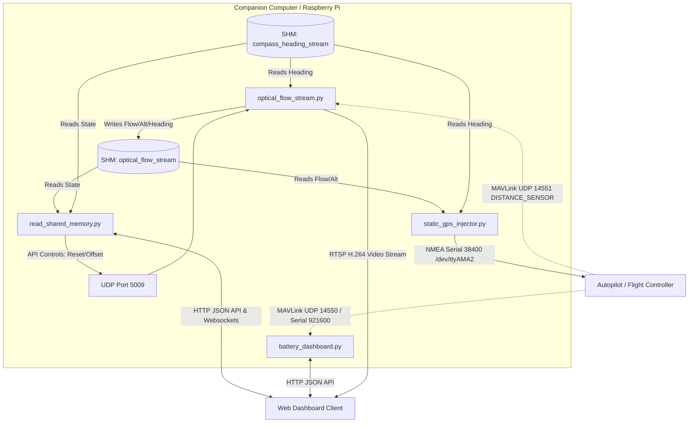

# Data Communication Architecture

This document describes the data communication channels, protocols, and interfaces used in the **Optical Flow Drone** project. The communication architecture ranges from low-level hardware serial links to inter-process shared memory and high-level HTTP APIs.

---

## 1. Inter-Process Communication (IPC) via Shared Memory

To achieve high-rate, low-latency communication between independent scripts running on the Raspberry Pi, the system uses Python `multiprocessing.shared_memory` segments.

### A. Optical Flow Stream Memory (`optical_flow_stream`)
* **Writer:** [optical_flow_stream.py](file:///e:/OptFlowDrone/OpticalFlowDrone/optical_flow_stream.py)
* **Readers:** [static_gps_injector.py](file:///e:/OptFlowDrone/OpticalFlowDrone/static_gps_injector.py) and [read_shared_memory.py](file:///e:/OptFlowDrone/OpticalFlowDrone/read_shared_memory.py)
* **Data Layout:** A circular ring buffer structure designed to handle high-frequency writes without thread blocking.
  * **Header Format (`<4sII`):** Magic string (`"FLOW"`), Write Index (uint32), Sample Count (uint32).
  * **Record Format (`<11d`):** Timestamp, $X_{\text{cm}}$, $Y_{\text{cm}}$, Raw $X_{\text{cm}}$, Raw $Y_{\text{cm}}$, $V_x$, $V_y$, Raw $V_x$, Raw $V_y$, Altitude, Heading.
  * **Buffer Size:** Max 120 samples.

### B. Compass Stream Memory (`compass_heading_stream`)
* **Reader:** [optical_flow_stream.py](file:///e:/OptFlowDrone/OpticalFlowDrone/optical_flow_stream.py) and [static_gps_injector.py](file:///e:/OptFlowDrone/OpticalFlowDrone/static_gps_injector.py)
* **Data Layout:** 
  * **Header Format (`<4sII`):** Magic string (`"CHDG"`), Write Index (uint32), Sample Count (uint32).
  * **Record Format (`<6d`):** Timestamp, Raw Heading, Smoothed Heading, Magnetometer $X$, Magnetometer $Y$, Magnetometer $Z$.
  * **Buffer Size:** Max 120 samples.

---

## 2. Flight Controller GPS Telemetry Injection (Serial NMEA)

**File location:** [static_gps_injector.py](file:///e:/OptFlowDrone/OpticalFlowDrone/static_gps_injector.py)

The companion computer injects the fused position and orientation back to ArduPilot/PX4 by acting as a virtual GPS receiver.

* **Interface:** Hardware UART `/dev/ttyAMA2`
* **Settings:** Baud rate **38400**, 8N1.
* **Protocol:** Standard NMEA 0183 sentences. At **10 Hz**, the injector outputs:
  * **`$GPGGA`**: Fuses UTC Time, calculated Latitude, Longitude, RTK Fix Quality ("4"), Satellites ("30"), HDOP ("0.1"), and Rangefinder Altitude.
  * **`$GPRMC`**: Fuses UTC Time, Validity flag, calculated Latitude/Longitude coordinates, Speed, and Track Angle.
  * **`$GPGSA`**: Broadcasts active satellite numbers and precision metrics (PDOP, HDOP, VDOP) to satisfy autopilot validation checks.
  * **`$GPHDT`**: Broadcasts the absolute True Heading from the compass telemetry.

---

## 3. MAVLink Telemetry Streams

* **Connection Strings:** 
  * `udp:127.0.0.1:14551` (Rangefinder data to `optical_flow_stream.py`)
  * `udp:127.0.0.1:14550` or `/dev/serial0` (Battery/Heartbeat telemetry to `battery_dashboard.py`)
* **Details:**
  * Uses the **MAVLink v2** protocol wrapped by `pymavlink`.
  * Allows the companion computer to listen passively to autopilot states (Arm/Disarm checks) and sensor telemetry (rangefinder distances, system health flags, battery state) generated by the flight controller.

---

## 4. Local Loopback UDP Commands

* **Interface:** Local UDP loopback (`127.0.0.1:5009`)
* **Details:**
  * Used to send real-time commands from Web Dashboard processes directly to the core camera processing loop.
  * Supported commands:
    * **`reset`**: Instructs the visual tracker to reset the coordinate accumulations back to zero.
    * **`offset <x_offset> <y_offset>`**: Dynamically updates the camera offsets ($C_x, C_y$) in the configuration parameters file.

---

## 5. Web Interface and APIs

* **Server:** Flask micro-framework
* **Endpoints:**
  * `POST /api/opticalflow/reset`: Calls local UDP loopback to trigger position reset.
  * `POST /api/opticalflow/offset`: Submits updated physical camera offset settings.
  * `GET /api/shm/config`: Exposes shared memory layouts and registry keys.
  * `GET /api/shm/mock/<name>`: Triggers mock telemetry data generators.
