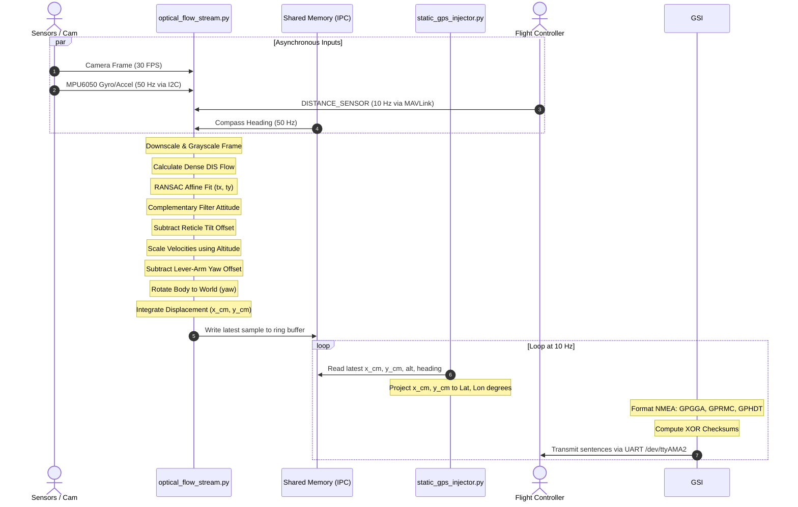

# Detailed Processing Flow: From Frame to Injection

This document describes the step-by-step sequence of events that occurs inside the companion computer, starting from the physical capture of a camera frame and culminating in the injection of latitude/longitude coordinates into the autopilot.



---

## Step 1: Data Ingestion and Synchronization

The pipeline begins with four parallel, asynchronous data streams entering the core visual tracker:

### 1. Frame Capture (30 Hz)
* **Code Location:** [optical_flow_stream.py](file:///e:/OptFlowDrone/OpticalFlowDrone/optical_flow_stream.py#L375)
* **Snippet:**
  ```python
  frame = ensure_bgr(picam2.capture_array())
  ```

### 2. Inertial Measurement (50 Hz)
* **Code Location:** [sensor_readers.py](file:///e:/OptFlowDrone/OpticalFlowDrone/optical_flow/sensor_readers.py#L287-L301)
* **Equations (LSB to Physical Scaling):**
  $$a_{\text{g}} = \frac{\text{ACCEL\_OUT}}{16384.0 \text{ LSB/g}}$$
  $$\omega_{\text{dps}} = \frac{\text{GYRO\_OUT}}{131.0 \text{ LSB/dps}} - \omega_{\text{bias}}$$
* **Snippet:**
  ```python
  ax_raw = read_i2c_word(bus, IMU_I2C_ADDR, ACCEL_XOUT_H)
  ay_raw = read_i2c_word(bus, IMU_I2C_ADDR, ACCEL_YOUT_H)
  az_raw = read_i2c_word(bus, IMU_I2C_ADDR, ACCEL_ZOUT_H)
  gx_raw = read_i2c_word(bus, IMU_I2C_ADDR, GYRO_XOUT_H)
  gy_raw = read_i2c_word(bus, IMU_I2C_ADDR, GYRO_YOUT_H)
  gz_raw = read_i2c_word(bus, IMU_I2C_ADDR, GYRO_ZOUT_H)

  xaccel_g = ax_raw / ACCEL_LSB_PER_G
  yaccel_g = ay_raw / ACCEL_LSB_PER_G
  zaccel_g = az_raw / ACCEL_LSB_PER_G
  xgyro_dps = (gx_raw / GYRO_LSB_PER_DPS) - gyro_bias["x"]
  ygyro_dps = (gy_raw / GYRO_LSB_PER_DPS) - gyro_bias["y"]
  zgyro_dps = (gz_raw / GYRO_LSB_PER_DPS) - gyro_bias["z"]
  ```

### 3. Altitude Telemetry (10 Hz)
* **Code Location:** [sensor_readers.py](file:///e:/OptFlowDrone/OpticalFlowDrone/optical_flow/sensor_readers.py#L270-L273)
* **Snippet:**
  ```python
  if msg_type == "DISTANCE_SENSOR":
      with distance_lock:
          distance_state["current_distance"] = msg.current_distance
          distance_state["last_update"] = now
  ```

### 4. Compass Telemetry (50 Hz)
* **Code Location:** [sensor_readers.py](file:///e:/OptFlowDrone/OpticalFlowDrone/optical_flow/sensor_readers.py#L235-L238)
* **Snippet:**
  ```python
  with compass_lock:
      compass_state["heading_deg"] = invert_compass_heading_deg(sample["heading"])
      compass_state["timestamp"] = sample["timestamp"]
      compass_state["last_update"] = time.time()
  ```

---

## Step 2: Image and Motion Processing

Once a frame is acquired, it undergoes immediate transformation and motion analysis inside the main execution thread of `optical_flow_stream.py`:

### 1. Image Reduction
* **Code Location:** [flow_processor.py](file:///e:/OptFlowDrone/OpticalFlowDrone/optical_flow/flow_processor.py#L101-L103)
* **Snippet:**
  ```python
  def to_small_gray(frame):
      small = cv2.resize(frame, None, fx=FLOW_SCALE, fy=FLOW_SCALE, interpolation=cv2.INTER_AREA)
      return cv2.cvtColor(small, cv2.COLOR_BGR2GRAY)
  ```

### 2. Dense Optical Flow Extraction
* **Code Location:** [flow_processor.py](file:///e:/OptFlowDrone/OpticalFlowDrone/optical_flow/flow_processor.py#L54-L66)
* **Snippet:**
  ```python
  # Compute dense optical flow
  flow = dis_flow.calc(old_gray, frame_gray, None)

  h, w = old_gray.shape
  # Create grid of points in the downscaled space
  ys, xs = np.mgrid[step//2:h:step, step//2:w:step].astype(np.float32)
  P_old = np.stack((xs, ys), axis=-1).reshape(-1, 2)

  # Get flow vectors at the grid points
  u = flow[ys.astype(int), xs.astype(int), 0]
  v = flow[ys.astype(int), xs.astype(int), 1]
  flow_vectors = np.stack((u, v), axis=-1).reshape(-1, 2)
  P_new = P_old + flow_vectors
  ```

### 3. Motion Vector Fitting (RANSAC Affine Model)
* **Code Location:** [flow_processor.py](file:///e:/OptFlowDrone/OpticalFlowDrone/optical_flow/flow_processor.py#L77-L97)
* **Equations (Transformation Parameters):**
  $$\begin{bmatrix} x_{\text{new}} \\ y_{\text{new}} \end{bmatrix} = \begin{bmatrix} s \cos\theta & -s \sin\theta \\ s \sin\theta & s \cos\theta \end{bmatrix} \begin{bmatrix} x_{\text{old}} \\ y_{\text{old}} \end{bmatrix} + \begin{bmatrix} t_x \\ t_y \end{bmatrix}$$
  $$s = \sqrt{M_{0, 0}^2 + M_{1, 0}^2}, \quad \theta = \operatorname{atan2}(M_{1, 0}, M_{0, 0}), \quad t_x = M_{0, 2}, \quad t_y = M_{1, 2}$$
* **Snippet:**
  ```python
  # Robustly estimate partial affine transform (translation, rotation, scale) using RANSAC
  affine_result = cv2.estimateAffinePartial2D(old_filtered, new_filtered, method=cv2.RANSAC, ransacReprojThreshold=2.0)
  M, inlier_mask = affine_result

  # Extract motion parameters from the affine matrix M
  tx = float(M[0, 2])
  ty = float(M[1, 2])
  scale = float(math.sqrt(M[0, 0]**2 + M[1, 0]**2))
  theta = float(math.atan2(M[1, 0], M[0, 0]))
  ```

### 4. Attitude Computation (Complementary Filter)
* **Code Location:** [sensor_readers.py](file:///e:/OptFlowDrone/OpticalFlowDrone/optical_flow/sensor_readers.py#L349-L362)
* **Equations (Complementary Blend):**
  $$\theta_t = \alpha (\theta_{t-1} + \omega \cdot dt) + (1-\alpha)\theta_{\text{static}}$$
* **Snippet:**
  ```python
  attitude_state["roll_deg"] = normalize_angle_deg(
      (COMPLEMENTARY_FILTER_ALPHA * roll_gyro_deg)
      + ((1.0 - COMPLEMENTARY_FILTER_ALPHA) * roll_accel_deg)
  )
  attitude_state["pitch_deg"] = normalize_angle_deg(
      (COMPLEMENTARY_FILTER_ALPHA * pitch_gyro_deg)
      + ((1.0 - COMPLEMENTARY_FILTER_ALPHA) * pitch_accel_deg)
  )
  ```

### 5. Perspective Tilt Compensation
* **Code Location:** [optical_flow_stream.py](file:///e:/OptFlowDrone/OpticalFlowDrone/optical_flow_stream.py#L389-L420)
* **Equations (Tilt Visual Translation Subtraction):**
  $$d_{\text{reticle}, x} = \text{roll\_px}_t - \text{roll\_px}_{t-1}$$
  $$d_{\text{reticle}, y} = \text{pitch\_px}_t - \text{pitch\_px}_{t-1}$$
  $$t_{x,\text{compensated}} = t_x - (\text{scale}_x \cdot d_{\text{reticle}, x})$$
  $$t_{y,\text{compensated}} = t_y - (\text{scale}_y \cdot d_{\text{reticle}, y})$$
* **Snippet:**
  ```python
  roll_px = np.clip(roll_deg * RETICLE_ROLL_SCALE_PX_PER_DEG, -frame_width * 0.35, frame_width * 0.35)
  pitch_px = np.clip(-pitch_deg * RETICLE_PITCH_SCALE_PX_PER_DEG, -frame_height * 0.35, frame_height * 0.35)

  d_reticle_x = roll_px - prev_roll_px
  d_reticle_y = pitch_px - prev_pitch_px

  # Apply reticle-based tilt compensation
  tx_comp = tx - (scale_x * d_reticle_x)
  ty_comp = ty - (scale_y * d_reticle_y)
  ```

### 6. Physical Velocity Scaling
* **Code Location:** [optical_flow_stream.py](file:///e:/OptFlowDrone/OpticalFlowDrone/optical_flow_stream.py#L425-L428)
* **Equations (Pixel-to-Meter Projection):**
  $$v_{x,\text{body}} = \frac{t_{x,\text{comp}} \cdot h}{f_x \cdot dt}$$
  $$v_{y,\text{body}} = -\frac{t_{y,\text{comp}} \cdot h}{f_y \cdot dt}$$
* **Snippet:**
  ```python
  # Calculate physical velocity using compensated translations (body frame)
  altitude_m = (altitude_cm / 100.0) if altitude_cm is not None else 1.5
  vx_mps_body = ((tx_comp * altitude_m) / (focal_length_x_px * dt_s))
  vy_mps_body = -((ty_comp * altitude_m) / (focal_length_y_px * dt_s))
  ```

### 7. Lever-Arm Offset Correction
* **Code Location:** [optical_flow_stream.py](file:///e:/OptFlowDrone/OpticalFlowDrone/optical_flow_stream.py#L430-L435)
* **Equations (Rotational Translation Offset Correction):**
  $$v_{\text{offset}, x} = -\omega_z \cdot C_y, \quad v_{\text{offset}, y} = \omega_z \cdot C_x$$
  $$v_{x,\text{body, comp}} = v_{x,\text{body}} - v_{\text{offset}, x}$$
  $$v_{y,\text{body, comp}} = v_{y,\text{body}} - v_{\text{offset}, y}$$
* **Snippet:**
  ```python
  # Compensate for camera offset from center of rotation
  yaw_rate_rad = math.radians(zgyro_dps)
  v_offset_x = -yaw_rate_rad * (camera_offset_y / 100.0)
  v_offset_y = yaw_rate_rad * (camera_offset_x / 100.0)
  vx_mps_body_comp = vx_mps_body - v_offset_x
  vy_mps_body_comp = vy_mps_body - v_offset_y
  ```

### 8. Inertial World Rotation
* **Code Location:** [optical_flow_stream.py](file:///e:/OptFlowDrone/OpticalFlowDrone/optical_flow_stream.py#L438-L443)
* **Equations (2D Frame Rotation):**
  $$V_{x,\text{world}} = v_{x,\text{body, comp}} \cos\psi + v_{y,\text{body, comp}} \sin\psi$$
  $$V_{y,\text{world}} = -v_{x,\text{body, comp}} \sin\psi + v_{y,\text{body, comp}} \cos\psi$$
* **Snippet:**
  ```python
  # Rotate compensated velocities to absolute frame (East/North) using actual compass heading
  yaw_actual_deg = -yaw_deg
  yaw_rad = math.radians(yaw_actual_deg)
  cos_yaw = math.cos(yaw_rad)
  sin_yaw = math.sin(yaw_rad)
  vx_mps_calc = vx_mps_body_comp * cos_yaw + vy_mps_body_comp * sin_yaw
  vy_mps_calc = -vx_mps_body_comp * sin_yaw + vy_mps_body_comp * cos_yaw
  ```

### 9. Dead Reckoning Integration
* **Code Location:** [optical_flow_stream.py](file:///e:/OptFlowDrone/OpticalFlowDrone/optical_flow_stream.py#L478-L481)
* **Equations (Integration):**
  $$x_t = x_{t-1} + V_{x,\text{world}} \cdot dt$$
  $$y_t = y_{t-1} + V_{y,\text{world}} \cdot dt$$
* **Snippet:**
  ```python
  with position_lock:
      position_state["x_cm"] += vx_mps * 100.0 * dt_s
      position_state["y_cm"] += vy_mps * 100.0 * dt_s
  ```

---

## Step 3: Inter-Process Communication Write

* **Code Location:** [optical_flow_stream.py](file:///e:/OptFlowDrone/OpticalFlowDrone/optical_flow_stream.py#L517-L529)
* **Snippet:**
  ```python
  write_flow_stream_sample(
      frame_ts,
      current_x_cm,
      current_y_cm,
      x_raw_cm,
      y_raw_cm,
      current_vx,
      current_vy,
      vx_raw_mps,
      vy_raw_mps,
      current_alt,
      (-yaw_deg) % 360.0
  )
  ```

---

## Step 4: GPS Telemetry Generation and Injection

In a parallel process, the GPS injector runs a 10 Hz loop to fetch, process, and transmit the tracking data:

### 1. Shared Memory Fetch
* **Code Location:** [static_gps_injector.py](file:///e:/OptFlowDrone/OpticalFlowDrone/static_gps_injector.py#L163-L172)
* **Snippet:**
  ```python
  flow_data = get_latest_flow_data()
  current_alt = float(DEFAULT_ALTITUDE)
  if flow_data is not None:
      x_m, y_m, alt = flow_data
  ```

### 2. Coordinate Projection
* **Code Location:** [static_gps_injector.py](file:///e:/OptFlowDrone/OpticalFlowDrone/static_gps_injector.py#L167-L172)
* **Equations (Flat-Grid to Spherical GPS Projection):**
  $$\text{latitude}_t = \text{START\_LAT} + \left( \frac{y_{\text{world}}}{R_{\text{earth}}} \right) \cdot \left( \frac{180}{\pi} \right)$$
  $$\text{longitude}_t = \text{START\_LON} + \left( \frac{x_{\text{world}}}{R_{\text{earth}} \cdot \cos(\text{latitude}_t)} \right) \cdot \left( \frac{180}{\pi} \right)$$
* **Snippet:**
  ```python
  # Earth radius in meters
  EARTH_RADIUS = 6378137.0
  # Convert meters displacement to degrees latitude and longitude
  lat = START_LAT + (y_m / EARTH_RADIUS) * (180.0 / math.pi)
  lon = START_LON + (x_m / EARTH_RADIUS) / math.cos(math.radians(lat)) * (180.0 / math.pi)
  current_alt = alt
  ```

### 3. NMEA Packet Synthesis & Checksumming
* **Code Location:** [static_gps_injector.py](file:///e:/OptFlowDrone/OpticalFlowDrone/static_gps_injector.py#L174-L227)
* **Equations (XOR Checksumming):**
  $$\text{checksum\_val} = \bigoplus_{i} \operatorname{char}_i$$
* **Snippet:**
  ```python
  nmea_lat, ns = to_nmea_lat(lat)
  nmea_lon, ew = to_nmea_lon(lon)

  gga = f"GPGGA,{utc},{nmea_lat},{ns},{nmea_lon},{ew},{FIX_QUALITY},{NUM_SATELLITES},{HDOP},{current_alt:.2f},{ALTITUDE_UNIT},{GEOIDAL_HEIGHT},{GEOIDAL_HEIGHT_UNIT},,"
  rmc = f"GPRMC,{utc},{RMC_STATUS},{nmea_lat},{ns},{nmea_lon},{ew},{SPEED_OVER_GROUND},{TRACK_ANGLE},{date},{MAG_VAR},{MAG_VAR_DIR},{MODE_INDICATOR}"
  hdt = f"GPHDT,{current_yaw},T"

  for msg in (gga, rmc, gsa, hdt):
      line = f"${msg}*{checksum(msg)}\r\n"
      ser.write(line.encode())
  ```
