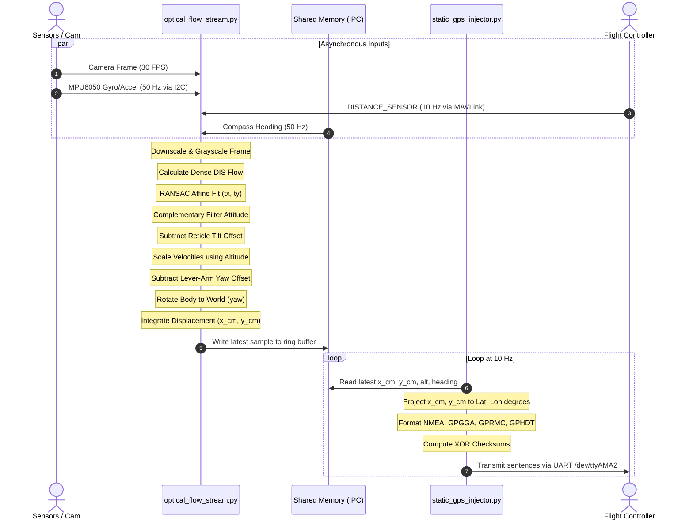

# Detailed Processing Flow: From Frame to Injection

This document describes the step-by-step sequence of events that occurs inside the companion computer, starting from the physical capture of a camera frame and culminating in the injection of latitude/longitude coordinates into the autopilot.

---

## Step 1: Data Ingestion and Synchronization

The pipeline begins with four parallel, asynchronous data streams entering the core visual tracker:

1. **Frame Capture (30 Hz)**: The `Picamera2` thread captures a $640 \times 480$ BGR image array.
2. **Inertial Measurement (50 Hz)**: The `imu_reader` thread polls the MPU6050 via I2C to calculate angular rates and linear accelerations.
3. **Altitude Telemetry (10 Hz)**: The `mavlink_reader` thread receives `DISTANCE_SENSOR` packets from ArduPilot to provide height-above-ground ($h$).
4. **Compass telemetry (50 Hz)**: The `compass_reader_thread` reads absolute orientation coordinates from shared memory.

---

## Step 2: Image and Motion Processing

Once a frame is acquired, it undergoes immediate transformation and motion analysis:

1. **Image Reduction**: The image is downscaled to $320 \times 240$ and converted to grayscale.
2. **Dense Optical Flow Extraction**: The DIS algorithm calculates pixel movement vectors for all pixels.
3. **Motion Vector Fitting**: The pixel vectors are grid-sampled and fitted using RANSAC into a partial affine matrix, extracting translation velocities ($t_x, t_y$), scaling ($s$), and rotation ($\theta$).
4. **Attitude Computation**: The IMU outputs are blended using the complementary filter to compute pitch and roll.
5. **Perspective Tilt Compensation**: The change in pitch and roll since the last frame is used to calculate the expected pixel shift from rotation. This expected shift is subtracted from the affine translation ($t_x, t_y$), leaving only pure translational pixel displacement ($t_{x,\text{comp}}, t_{y,\text{comp}}$).
6. **Physical Velocity Scaling**: The corrected pixel velocities are converted into body-frame physical velocities ($V_{x,\text{body}}, V_{y,\text{body}}$) in meters per second using the current altitude $h$:
   $$V_{\text{body}} = \frac{t_{\text{comp}} \cdot h}{f \cdot dt}$$
7. **Lever-Arm Offset Correction**: If the camera is placed away from the drone's center of gravity, yaw-induced translation is subtracted using the camera installation offsets ($C_x, C_y$) and the gyroscope yaw rate ($\omega_z$).
8. **Inertial World Rotation**: The corrected body-frame velocities are rotated into global coordinate axes (East/North) using the vehicle's yaw heading ($\psi$).
9. **Dead Reckoning Integration**: Global velocities are integrated over time $dt$ to increment the position displacement relative to the starting location:
   $$x_{\text{world}} = x_{\text{world\_prev}} + V_{\text{world}, x} \cdot dt$$
   $$y_{\text{world}} = y_{\text{world\_prev}} + V_{\text{world}, y} \cdot dt$$

---

## Step 3: Inter-Process Communication Write

* The computed coordinates ($x_{\text{world}}, y_{\text{world}}$), velocities, rangefinder altitude, and heading are packed into binary formats.
* They are written directly to the `optical_flow_stream` shared memory segment's circular buffer, updating the write index.

---

## Step 4: GPS Telemetry Generation and Injection

In a parallel process, the GPS injector runs a 10 Hz loop to fetch, process, and transmit the tracking data:

1. **Shared Memory Fetch**: The injector polls the `optical_flow_stream` shared memory segment to extract the latest integrated offsets ($x_{\text{world}}, y_{\text{world}}$), altitude ($h$), and compass heading ($\psi$).
2. **Coordinate Projection**: The physical displacement (in meters) is converted to latitude and longitude coordinates relative to a configured origin:
   $$\text{latitude} = \text{START\_LAT} + \left( \frac{y_{\text{world}}}{R_{\text{earth}}} \right) \cdot \left( \frac{180}{\pi} \right)$$
   $$\text{longitude} = \text{START\_LON} + \left( \frac{x_{\text{world}}}{R_{\text{earth}} \cdot \cos(\text{latitude})} \right) \cdot \left( \frac{180}{\pi} \right)$$
3. **NMEA Packet Synthesis**: The calculated Latitude, Longitude, Altitude, Heading, and UTC time are formatted into standardized NMEA sentences:
   * **`$GPGGA`**: Fuses position coordinates, RTK fix status, satellite count, and rangefinder altitude.
   * **`$GPRMC`**: Fuses position coordinates, velocity vector, and time.
   * **`$GPHDT`**: Fuses absolute true heading.
4. **Checksum Verification**: For each NMEA sentence, an 8-bit XOR checksum is calculated and appended.
5. **Physical UART Injection**: The formatted lines are sent out over `/dev/ttyAMA2` serial interface. The autopilot reads these signals, decodes them as a high-precision RTK GPS receiver, and updates its position state to enable automated flight.
