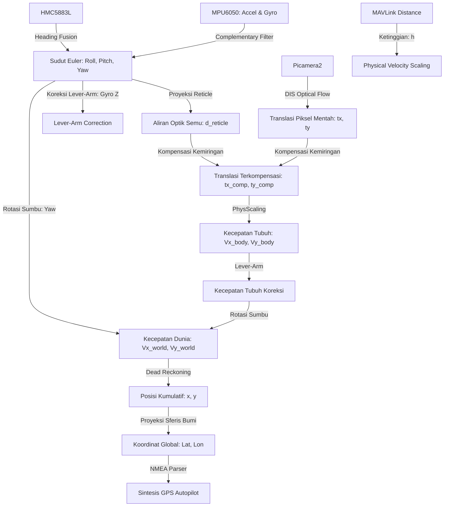

# Dokumen Pemodelan Matematika Sistem Optical Flow Drone

Dokumen ini menyajikan pemodelan matematika lengkap, derivasi rumus, dan implementasi algoritma yang digunakan dalam sistem **Optical Flow Drone**. Pemodelan ini menjembatani data sensor mentah (IMU, Barometer/Rangefinder, Kompas, dan Kamera) menjadi estimasi posisi koordinat global ($Latitude, Longitude$) secara real-time.

---

## 1. Sistem Koordinat (Reference Frames)

Untuk memahami model matematika yang digunakan, didefinisikan dua sistem koordinat utama:
1. **Body Frame (Bingkai Tubuh Drone - $B$):** Berpusat pada titik berat (Center of Gravity/CoG) drone.
   - Sumbu $X_B$: Menghadap ke arah depan drone (Forward).
   - Sumbu $Y_B$: Menghadap ke arah kanan drone (Right).
   - Sumbu $Z_B$: Menghadap ke arah bawah drone (Down) - mengikuti konvensi NED (North-East-Down).
2. **World Frame (Bingkai Dunia/Bumi - $W$):** Berpusat pada titik awal drone dinyalakan (Home/Origin).
   - Sumbu $X_W$: Menghadap ke arah **Timur** (East).
   - Sumbu $Y_W$: Menghadap ke arah **Utara** (North).
   - Sumbu $Z_W$: Menghadap ke atas (Up).

---

## 2. Estimasi Sikap Wahana (Attitude Estimation)
**Implementasi pada:** [sensor_readers.py](file:///e:/OptFlowDrone/OpticalFlowDrone/optical_flow/sensor_readers.py)

Sikap wahana diekspresikan dalam sudut Euler: Roll ($\phi$), Pitch ($\theta$), dan Yaw/Heading ($\psi$). Penggabungan data frekuensi tinggi (Giroskop) dengan data referensi stabil jangka panjang (Akselerometer & Kompas) dilakukan dengan **Complementary Filter**.

### A. Estimasi Sudut Kemiringan Statis dari Akselerometer
Akselerometer mengukur total percepatan spesifik yang dirasakan drone. Dalam kondisi kuasi-statis, vektor gravitasi mendominasi pembacaan:

$$\phi_{\text{accel}} = \operatorname{atan2}(a_y, a_z) \cdot \left(\frac{180}{\pi}\right)$$

$$\theta_{\text{accel}} = \operatorname{atan2}\left(-a_x, \sqrt{a_y^2 + a_z^2}\right) \cdot \left(\frac{180}{\pi}\right)$$

*Di mana:*
- $a_x, a_y, a_z$ adalah percepatan dalam satuan $g$ pada sumbu tubuh drone (dibaca pada baris [L296-L298](file:///e:/OptFlowDrone/OpticalFlowDrone/optical_flow/sensor_readers.py#L296-L298)).

**Implementasi Kode:**
```python
xaccel_g = ax_raw / ACCEL_LSB_PER_G
yaccel_g = ay_raw / ACCEL_LSB_PER_G
zaccel_g = az_raw / ACCEL_LSB_PER_G

roll_deg = math.degrees(math.atan2(ay_g, az_g))
pitch_deg = math.degrees(math.atan2(-ax_g, math.sqrt((ay_g * ay_g) + (az_g * az_g))))
```

### B. Integrasi Kecepatan Sudut Giroskop
Kecepatan sudut dari giroskop ($\omega_x, \omega_y, \omega_z$ dalam derajat per detik) diintegrasikan terhadap waktu $dt$ untuk memperbarui estimasi sudut:

$$\phi_{\text{gyro}, t} = \phi_{t-1} + \omega_x \cdot dt$$

$$\theta_{\text{gyro}, t} = \theta_{t-1} + \omega_y \cdot dt$$

$$\psi_{\text{gyro}, t} = \psi_{t-1} + \omega_z \cdot dt$$

**Implementasi Kode:**
```python
roll_gyro_deg = attitude_state["roll_deg"] + (xgyro_dps * dt)
pitch_gyro_deg = attitude_state["pitch_deg"] + (ygyro_dps * dt)
yaw_gyro_deg = attitude_state["yaw_deg"] + (zgyro_dps * dt)
```

### C. Persamaan Complementary Filter (Sensor Fusion)
Untuk menggabungkan karakteristik giroskop (presisi jangka pendek, rentan hanyut/drift) dan akselerometer/kompas (berisik jangka pendek, stabil jangka panjang):

#### 1. Penggabungan Roll dan Pitch:
$$\phi_t = \alpha \cdot (\phi_{t-1} + \omega_x \cdot dt) + (1 - \alpha) \cdot \phi_{\text{accel}}$$

$$\theta_t = \alpha \cdot (\theta_{t-1} + \omega_y \cdot dt) + (1 - \alpha) \cdot \theta_{\text{accel}}$$

*Di mana:*
- $\alpha = 0.96$ (konstanta `COMPLEMENTARY_FILTER_ALPHA` pada baris [L23](file:///e:/OptFlowDrone/OpticalFlowDrone/optical_flow/sensor_readers.py#L23)).

#### 2. Penggabungan Yaw/Heading dengan Kompas:
Sudut yaw diintegrasikan dari giroskop $\omega_z$ dan diselaraskan secara lambat menggunakan pembacaan heading magnetometer/kompas $\psi_{\text{compass}}$:

$$\psi_t = \operatorname{blend\_angle\_deg}(\psi_{\text{gyro}, t}, \psi_{\text{compass}}, 1 - \alpha)$$

**Implementasi Kode:**
```python
# Roll & Pitch Complementary Filter Blending
attitude_state["roll_deg"] = normalize_angle_deg(
    (COMPLEMENTARY_FILTER_ALPHA * roll_gyro_deg)
    + ((1.0 - COMPLEMENTARY_FILTER_ALPHA) * roll_accel_deg)
)
attitude_state["pitch_deg"] = normalize_angle_deg(
    (COMPLEMENTARY_FILTER_ALPHA * pitch_gyro_deg)
    + ((1.0 - COMPLEMENTARY_FILTER_ALPHA) * pitch_accel_deg)
)

# Yaw & Compass Fusion
if compass_heading_deg is not None and compass_age_s is not None and compass_age_s <= COMPASS_FRESHNESS_THRESHOLD_S:
    attitude_state["yaw_deg"] = blend_angle_deg(
        yaw_gyro_deg,
        compass_heading_deg,
        1.0 - COMPLEMENTARY_FILTER_ALPHA,
    )
else:
    attitude_state["yaw_deg"] = normalize_angle_deg(yaw_gyro_deg)
```

---

## 3. Estimasi Gerakan Visual (Visual Motion Estimation)
**Implementasi pada:** [flow_processor.py](file:///e:/OptFlowDrone/OpticalFlowDrone/optical_flow/flow_processor.py)

Kamera bawah drone menangkap pergeseran visual tanah. Pergeseran piksel dihitung menggunakan algoritma **Dense Inverse Search (DIS) Optical Flow** dan dicocokkan ke model gerak spasial.

### A. DIS Optical Flow
Algoritma DIS menghitung medan vektor perpindahan piksel padat:
$$\mathbf{f}(x, y) = [u(x, y), v(x, y)]^T$$

### B. Model Geometri Affine Parsial 2D (4 Derajat Kebebasan)
Translasi kamera ($t_x, t_y$), perubahan skala ($s$), dan rotasi sudut gambar ($\theta_c$) dimodelkan melalui transformasi koordinat piksel lama $(x_{\text{old}}, y_{\text{old}})$ ke koordinat piksel baru $(x_{\text{new}}, y_{\text{new}})$:

$$\begin{bmatrix} x_{\text{new}} \\ y_{\text{new}} \end{bmatrix} = \begin{bmatrix} s \cos\theta_c & -s \sin\theta_c \\ s \sin\theta_c & s \cos\theta_c \end{bmatrix} \begin{bmatrix} x_{\text{old}} \\ y_{\text{old}} \end{bmatrix} + \begin{bmatrix} t_x \\ t_y \end{bmatrix}$$

Persamaan di atas diselesaikan secara robust menggunakan metode **RANSAC** (`cv2.estimateAffinePartial2D`) untuk memisahkan pergeseran tanah dominan dari derau visual.

Parameter gerakan diekstraksi dari matriks transformasi $M$ yang dihasilkan:
- Translasi piksel: 
  $$t_x = M_{0, 2}, \quad t_y = M_{1, 2}$$
- Perubahan skala citra: 
  $$s = \sqrt{M_{0, 0}^2 + M_{1, 0}^2}$$
- Rotasi citra: 
  $$\theta_c = \operatorname{atan2}(M_{1, 0}, M_{0, 0})$$

**Implementasi Kode:**
```python
# Menghitung affine transformasi menggunakan RANSAC
affine_result = cv2.estimateAffinePartial2D(old_filtered, new_filtered, method=cv2.RANSAC, ransacReprojThreshold=2.0)
if affine_result is not None and affine_result[0] is not None:
    M, inlier_mask = affine_result
    tx = float(M[0, 2])
    ty = float(M[1, 2])
    scale = float(math.sqrt(M[0, 0]**2 + M[1, 0]**2))
    theta = float(math.atan2(M[1, 0], M[0, 0]))
```

---

## 4. Kompensasi Sudut Kemiringan (Tilt Compensation)
**Implementasi pada:** [optical_flow_stream.py](file:///e:/OptFlowDrone/OpticalFlowDrone/optical_flow_stream.py)

Ketika drone miring (melakukan gerakan roll atau pitch), kamera ikut berputar dan menghasilkan aliran optik semu (*apparent optical flow*), meskipun drone tidak bergerak secara linier. Aliran semu ini harus dieliminasi menggunakan data IMU.

### A. Proyeksi Sudut ke Pergeseran Piksel Teoretis
Perubahan sudut pitch dan roll antara dua frame citra diproyeksikan menjadi pergeseran piksel virtual pada reticle tengah:

$$d_{\text{reticle}, x} = (\phi_t - \phi_{t-1}) \cdot K_{\text{roll}}$$

$$d_{\text{reticle}, y} = -(\theta_t - \theta_{t-1}) \cdot K_{\text{pitch}}$$

*Di mana:*
- $K_{\text{roll}}, K_{\text{pitch}}$ adalah faktor skala piksel per derajat kemiringan citra.

### B. Eliminasi Aliran Optik Semu
Translasi piksel yang murni disebabkan oleh translasi horizontal drone ($t_{x, \text{compensated}}, t_{y, \text{compensated}}$) dihitung dengan mengurangi pergeseran reticle IMU yang telah dikalibrasi ($\text{scale}_x, \text{scale}_y$):

$$t_{x, \text{compensated}} = t_x - (\text{scale}_x \cdot d_{\text{reticle}, x})$$

$$t_{y, \text{compensated}} = t_y - (\text{scale}_y \cdot d_{\text{reticle}, y})$$

**Implementasi Kode:**
```python
# 1. Hitung perpindahan reticle virtual
roll_px = np.clip(roll_deg * RETICLE_ROLL_SCALE_PX_PER_DEG, -frame_width * 0.35, frame_width * 0.35)
pitch_px = np.clip(-pitch_deg * RETICLE_PITCH_SCALE_PX_PER_DEG, -frame_height * 0.35, frame_height * 0.35)

d_reticle_x = roll_px - prev_roll_px
d_reticle_y = pitch_px - prev_pitch_px

# 2. Kurangi visual flow semu akibat kemiringan
tx_comp = tx - (scale_x * d_reticle_x)
ty_comp = ty - (scale_y * d_reticle_y)
```

---

## 5. Skala Kecepatan Fisik & Koreksi Eksentrisitas (Physical Velocity Scaling & Lever-Arm Offset)
**Implementasi pada:** [flow_processor.py](file:///e:/OptFlowDrone/OpticalFlowDrone/optical_flow/flow_processor.py) & [optical_flow_stream.py](file:///e:/OptFlowDrone/OpticalFlowDrone/optical_flow_stream.py)

### A. Penskalaan Kecepatan Fisik (Physical Velocity Scaling)
Translasi piksel terkompensasi ($t_{x, \text{compensated}}, t_{y, \text{compensated}}$) dikonversi ke kecepatan linier fisik dalam meter/detik ($m/s$) pada sistem koordinat Body Frame dengan memanfaatkan data ketinggian altitude ($h$ dalam meter) dan panjang fokus lensa ($f_x, f_y$ dalam piksel):

$$V_{x, \text{body}} = \frac{t_{x, \text{compensated}} \cdot h}{f_x \cdot dt}$$

$$V_{y, \text{body}} = -\frac{t_{y, \text{compensated}} \cdot h}{f_y \cdot dt}$$

**Implementasi Kode:**
```python
# Konversi translasi piksel ke kecepatan tubuh fisik (m/s)
altitude_m = (altitude_cm / 100.0) if altitude_cm is not None else 1.5
vx_mps_body = ((tx_comp * altitude_m) / (focal_length_x_px * dt_s))
vy_mps_body = -((ty_comp * altitude_m) / (focal_length_y_px * dt_s))
```

### B. Koreksi Lever-Arm Offset (Camera Eccentricity)
Jika kamera tidak diletakkan tepat di pusat rotasi drone (CoG), gerakan rotasi yaw drone ($\omega_z$) akan menghasilkan translasi linear palsu pada kamera. Koreksi dilakukan dengan memodelkan kinematika benda tegar:

$$v_{\text{offset}, x} = -\omega_z \cdot C_y$$

$$v_{\text{offset}, y} = \omega_z \cdot C_x$$

Kecepatan tubuh terkoreksi akhir menjadi:

$$V_{x, \text{body, comp}} = V_{x, \text{body}} - v_{\text{offset}, x}$$

$$V_{y, \text{body, comp}} = V_{y, \text{body}} - v_{\text{offset}, y}$$

**Implementasi Kode:**
```python
# Koreksi Lever-Arm Offset
yaw_rate_rad = math.radians(zgyro_dps)
v_offset_x = -yaw_rate_rad * (camera_offset_y / 100.0)
v_offset_y = yaw_rate_rad * (camera_offset_x / 100.0)

vx_mps_body_comp = vx_mps_body - v_offset_x
vy_mps_body_comp = vy_mps_body - v_offset_y
```

---

## 6. Transformasi Koordinat Tubuh ke Dunia (Body-to-World Rotation)
**Implementasi pada:** [optical_flow_stream.py](file:///e:/OptFlowDrone/OpticalFlowDrone/optical_flow_stream.py)

Kecepatan linier tubuh drone ($V_{x, \text{body, comp}}, V_{y, \text{body, comp}}$) ditransformasikan ke sistem koordinat dunia ($V_{x, \text{world}}, V_{y, \text{world}}$) menggunakan matriks rotasi 2D berdasarkan sudut yaw absolut kompas ($\psi$ dalam radian):

$$\begin{bmatrix} V_{x, \text{world}} \\ V_{y, \text{world}} \end{bmatrix} = \begin{bmatrix} \cos\psi & \sin\psi \\ -\sin\psi & \cos\psi \end{bmatrix} \begin{bmatrix} V_{x, \text{body, comp}} \\ V_{y, \text{body, comp}} \end{bmatrix}$$

Bila dijabarkan secara skalar:

$$V_{x, \text{world}} = V_{x, \text{body, comp}} \cdot \cos\psi + V_{y, \text{body, comp}} \cdot \sin\psi$$

$$V_{y, \text{world}} = -V_{x, \text{body, comp}} \cdot \sin\psi + V_{y, \text{body, comp}} \cdot \cos\psi$$

**Implementasi Kode:**
```python
yaw_actual_deg = -yaw_deg
yaw_rad = math.radians(yaw_actual_deg)
cos_yaw = math.cos(yaw_rad)
sin_yaw = math.sin(yaw_rad)

vx_mps_calc = vx_mps_body_comp * cos_yaw + vy_mps_body_comp * sin_yaw
vy_mps_calc = -vx_mps_body_comp * sin_yaw + vy_mps_body_comp * cos_yaw
```

---

## 7. Integrasi Posisi & Proyeksi Koordinat Global GPS
**Implementasi pada:** [static_gps_injector.py](file:///e:/OptFlowDrone/OpticalFlowDrone/static_gps_injector.py)

### A. Dead Reckoning (Integrasi Diskrit)
Posisi kumulatif drone relatif terhadap titik asal dihitung secara integrasi numerik Euler orde-1:

$$x_{\text{world}, t} = x_{\text{world}, t-1} + V_{x, \text{world}} \cdot dt$$

$$y_{\text{world}, t} = y_{\text{world}, t-1} + V_{y, \text{world}} \cdot dt$$

### B. Proyeksi Geodetis ke Koordinat GPS (Latitude/Longitude)
Menggunakan pendekatan kelengkungan bumi sferis dengan jari-jari bumi rata-rata ($R = 6.378.137,0\text{ meter}$), jarak perpindahan linier dalam meter dikonversi menjadi pergeseran sudut lintang dan bujur dari koordinat awal/referensi ($\text{lat}_0, \text{lon}_0$):

$$\text{lat}_t = \text{lat}_0 + \left( \frac{y_{\text{world}, t}}{R} \right) \cdot \left(\frac{180}{\pi}\right)$$

$$\text{lon}_t = \text{lon}_0 + \left( \frac{x_{\text{world}, t}}{R \cdot \cos\left(\text{lat}_t \cdot \frac{\pi}{180}\right)} \right) \cdot \left(\frac{180}{\pi}\right)$$

**Implementasi Kode:**
```python
# Lintang (Latitude)
lat_offset = (y_m / EARTH_RADIUS) * (180.0 / math.pi)
current_lat = home_lat + lat_offset

# Bujur (Longitude) - Memperhitungkan kelengkungan bumi di Latitude saat ini
lon_offset = (x_m / (EARTH_RADIUS * math.cos(math.radians(current_lat)))) * (180.0 / math.pi)
current_lon = home_lon + lon_offset
```

---

## Ringkasan Aliran Pemrosesan Data Matematika


