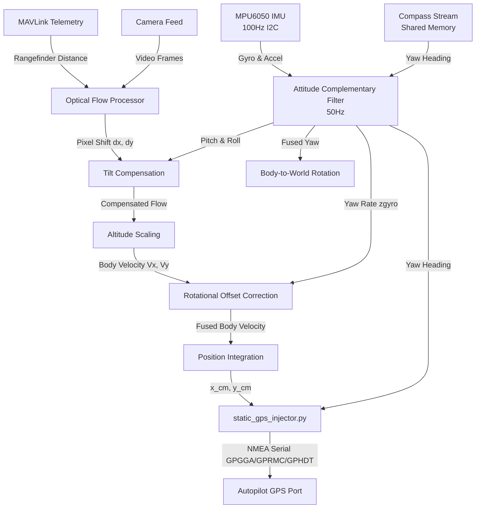

# Sensor Fusion Architecture and Implementation

This document details the multi-layer sensor fusion architecture used in the **Optical Flow Drone** project. The system blends inputs from various local sensors (MPU6050 IMU, rangefinder/distance sensor, compass) and visual tracking data (camera optical flow) to calculate accurate position, velocity, and orientation. This fused state is then injected back into the autopilot as simulated high-rate RTK GPS telemetry.

---

## 1. Attitude Estimation (Inertial & Compass Fusion)

**File location:** [sensor_readers.py](file:///e:/OptFlowDrone/OpticalFlowDrone/optical_flow/sensor_readers.py)  
**Process name:** `imu_reader` and `compass_reader_thread`  
**Rate:** ~50 Hz

This layer fuses raw angular rates from the gyroscope and gravity vectors from the accelerometer (on the MPU6050), alongside heading data from the external compass.

### Roll & Pitch Fusion
1. **Accelerometer Angle Calculation**: The gravity direction is used to estimate static tilt:
   $$\text{roll}_{\text{accel}} = \operatorname{atan2}(a_y, a_z)$$
   $$\text{pitch}_{\text{accel}} = \operatorname{atan2}\left(-a_x, \sqrt{a_y^2 + a_z^2}\right)$$
2. **Gyro Integration**: Gyroscope angular rates (with calibrated bias subtracted) are integrated:
   $$\text{angle}_{\text{gyro}} = \text{angle}_{\text{prev}} + \omega_{\text{gyro}} \cdot dt$$
3. **Complementary Blend**: Fuses the two sources to eliminate gyroscope drift while filtering high-frequency accelerometer noise:
   $$\text{fused\_angle} = 0.96 \cdot \text{angle}_{\text{gyro}} + 0.04 \cdot \text{angle}_{\text{accel}}$$

### Yaw & Compass Fusion
* The Z-axis gyroscope rates are integrated to get a continuous yaw rotation.
* If a fresh sample exists in the compass shared memory (`compass_heading_stream`), it blends the integrated yaw with the absolute compass heading:
  $$\text{fused\_yaw} = 0.96 \cdot \text{yaw}_{\text{gyro}} + 0.04 \cdot \text{yaw}_{\text{compass}}$$

---

## 2. Optical Flow Tilt Compensation (Vision & Attitude Fusion)

**File location:** [optical_flow_stream.py](file:///e:/OptFlowDrone/OpticalFlowDrone/optical_flow_stream.py)  
**Process name:** `record_optical_flow`  
**Rate:** Match frame rate (~30 Hz)

When a drone tilts (pitches or rolls) without moving laterally, the camera tilts with it, creating a visual flow sweep across the sensor. If uncompensated, this tilt would be misidentified as translational velocity, causing the drone to drift.

1. **Reticle Translation Calculation**: The system maps the roll and pitch changes since the last frame into expected pixel shifts ($\Delta x_{\text{reticle}}, \Delta y_{\text{reticle}}$) using calibrated ratios:
   $$\Delta x_{\text{reticle}} = \Delta\text{roll} \cdot S_{\text{roll}}$$
   $$\Delta y_{\text{reticle}} = \Delta\text{pitch} \cdot S_{\text{pitch}}$$
2. **Visual Flow Compensation**: The expected tilt-induced pixel shift is subtracted from the raw optical flow tracker's output ($t_x, t_y$):
   $$t_{x,\text{compensated}} = t_x - S_x \cdot \Delta x_{\text{reticle}}$$
   $$t_{y,\text{compensated}} = t_y - S_y \cdot \Delta y_{\text{reticle}}$$

---

## 3. Physical Scale Scaling (Vision & Altitude Fusion)

**File location:** [optical_flow_stream.py](file:///e:/OptFlowDrone/OpticalFlowDrone/optical_flow_stream.py)

To convert pixel velocities ($V_{\text{pixels}}$) into physical velocity ($V_{\text{m/s}}$), the camera's height above the ground is required. 

* The altitude $h$ is read from the rangefinder telemetry injected into the MAVLink port.
* Fusing the compensated visual translations, focal length ($f_x, f_y$), time difference ($dt$), and height ($h$) yields body-frame physical velocities:
  $$V_{x,\text{body}} = \frac{t_{x,\text{compensated}} \cdot h}{f_x \cdot dt}$$
  $$V_{y,\text{body}} = -\frac{t_{y,\text{compensated}} \cdot h}{f_y \cdot dt}$$

---

## 4. Camera Offset Correction (Rotation Correction)

**File location:** [optical_flow_stream.py](file:///e:/OptFlowDrone/OpticalFlowDrone/optical_flow_stream.py)

If the camera is not mounted exactly at the center of rotation of the drone, yawing/rotation of the vehicle will induce translation at the camera sensor.

* The system fuses the physical offsets of the camera ($C_x, C_y$ in cm) and the yaw rate ($\omega_z$) to subtract the rotational visual noise:
  $$V_{x,\text{body,\ comp}} = V_{x,\text{body}} - \left(-\omega_z \cdot \frac{C_y}{100.0}\right)$$
  $$V_{y,\text{body,\ comp}} = V_{y,\text{body}} - \left(\omega_z \cdot \frac{C_x}{100.0}\right)$$

---

## 5. Body-to-World Rotation (Inertial Frame Conversion)

**File location:** [optical_flow_stream.py](file:///e:/OptFlowDrone/OpticalFlowDrone/optical_flow_stream.py)

The physical velocities calculated above are relative to the camera's local body frame. To integrate these velocities into a global coordinate map, they must be rotated using the absolute yaw heading.

* The body-frame velocities are rotated using the fused yaw from the complementary filter ($\psi$):
  $$V_{x,\text{world}} = V_{x,\text{body,\ comp}} \cdot \cos(\psi) + V_{y,\text{body,\ comp}} \cdot \sin(\psi)$$
  $$V_{y,\text{world}} = -V_{x,\text{body,\ comp}} \cdot \sin(\psi) + V_{y,\text{body,\ comp}} \cdot \cos(\psi)$$

---

## 6. Dead Reckoning & Telemetry Injection

**Files:** [optical_flow_stream.py](file:///e:/OptFlowDrone/OpticalFlowDrone/optical_flow_stream.py) & [static_gps_injector.py](file:///e:/OptFlowDrone/OpticalFlowDrone/static_gps_injector.py)

* **Velocity Integration**: World velocities ($V_{x,\text{world}}, V_{y,\text{world}}$) are integrated over time $dt$ to keep track of absolute positions relative to the starting location:
  $$x_{\text{world}} = x_{\text{world,\ prev}} + V_{x,\text{world}} \cdot dt$$
  $$y_{\text{world}} = y_{\text{world,\ prev}} + V_{y,\text{world}} \cdot dt$$
* **NMEA Translation**: The integrated meters displacement ($x_{\text{world}}, y_{\text{world}}$) is converted to latitude and longitude coordinates using local earth-radius calculations and combined with rangefinder altitude and compass heading to format standardized NMEA sentence packets for closed-loop drone control.
