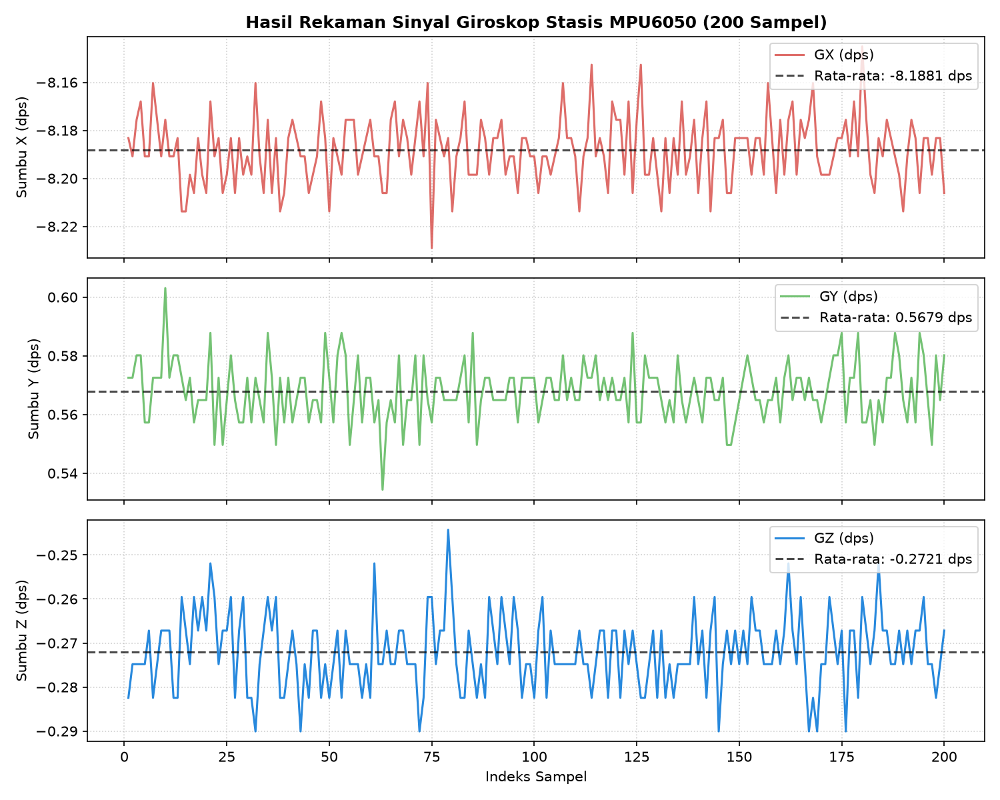

# Evaluasi Kalibrasi Bias Giroskop (Gyroscope Bias Evaluation)

Dokumen ini menganalisis hasil kalibrasi giroskop pada sensor IMU MPU6050 dengan nilai terukur:
$$\text{Bias Sumbu-X} = -8,1874\text{ dps}, \quad \text{Bias Sumbu-Y} = 0,5673\text{ dps}, \quad \text{Bias Sumbu-Z} = -0,2714\text{ dps}$$

Dokumen ini merinci bagaimana nilai bias tersebut diperoleh secara matematis, programmatis, serta menganalisis dampak fisik dan signifikansinya terhadap sistem navigasi.

---

## 1. Metodologi Perhitungan Bias (Programmatic Calculation)

Di dalam file driver pembaca sensor [sensor_readers.py](file:///e:/OptFlowDrone/OpticalFlowDrone/optical_flow/sensor_readers.py#L128-L150), nilai bias diperoleh melalui fungsi `calibrate_gyro_bias()` dengan langkah-langkah sistematis sebagai berikut:

### 1.1. Parameter Akuisisi Data
- **Kondisi Pengujian**: Wahana diletakkan diam sempurna (*stasis*) di atas meja uji horizontal datar tanpa getaran eksternal.
- **Jumlah Sampel ($N$)**: 200 sampel data.
- **Interval Waktu ($\Delta t$)**: $10\text{ ms}$ (`time.sleep(0.01)`), sehingga total durasi pengambilan sampel adalah sekitar 2 detik.
- **Sensitivitas Sensor**: MPU6050 diatur pada skala penuh $\pm 250^\circ/\text{s}$ (DPS), di mana faktor konversinya adalah:
  $$\text{Sensitivitas LSB} = 131,0\text{ LSB/dps}$$

### 1.2. Rumus Matematis Kalibrasi
Setiap pembacaan register mentah giroskop 16-bit bertanda dikonversikan menjadi satuan fisik derajat per detik ($\text{dps}$ atau $^\circ/\text{s}$) dengan membaginya dengan sensitivitas LSB. Nilai bias pada masing-masing sumbu adalah rata-rata aritmetika dari 200 sampel tersebut:

$$\text{Bias}_x = \frac{1}{N} \sum_{i=1}^{N} \frac{\text{Raw\_GX}_i}{131,0} = -8,1874\text{ dps}$$

$$\text{Bias}_y = \frac{1}{N} \sum_{i=1}^{N} \frac{\text{Raw\_GY}_i}{131,0} = 0,5673\text{ dps}$$

$$\text{Bias}_z = \frac{1}{N} \sum_{i=1}^{N} \frac{\text{Raw\_GZ}_i}{131,0} = -0,2714\text{ dps}$$

---

## 2. Analisis Nilai Bias dan Faktor Fisik

Hasil kalibrasi menunjukkan perbedaan karakteristik bias yang signifikan antar-sumbu, seperti yang dirangkum pada **Tabel 1**.

<p align="center"><b>Tabel 1.</b> Analisis Nilai Bias Giroskop MPU6050</p>

| Sumbu IMU | Nilai Bias (dps) | Status Deviasi | Analisis Penyebab Fisik |
|:---------:|:----------------:|:--------------:|:------------------------|
| **Sumbu-X** | $-8,1874$ | **Tinggi** | Bias yang cukup besar ini umumnya dipicu oleh ketidaksejajaran fisik pemasangan chip (*mounting tilt*) pada PCB, tegangan mekanis pada kaki-kaki solder (*solder joint mechanical stress*), atau ketidakseimbangan termal internal awal. |
| **Sumbu-Y** | $+0,5673$ | Rendah (Normal) | Berada pada batas toleransi deviasi pabrik yang umum untuk sensor berbasis MEMS berbiaya rendah. |
| **Sumbu-Z** | $-0,2714$ | Rendah (Normal) | Sumbu vertikal menunjukkan tingkat kestabilan statis yang sangat baik terhadap gaya gravitasi bumi. |

---

## 3. Implementasi Koreksi Data Waktu Nyata

Nilai bias yang diperoleh disimpan ke memori internal sistem dan dikurangkan dari setiap pembacaan mentah sensor saat sistem navigasi aktif. Konversi data bersih dirumuskan sebagai berikut:

```python
xgyro_dps = (gx_raw / 131.0) - gyro_bias["x"]
ygyro_dps = (gy_raw / 131.0) - gyro_bias["y"]
zgyro_dps = (gz_raw / 131.0) - gyro_bias["z"]
```

---

## 4. Dampak Jika Bias Tidak Dikoreksi (Significance of Calibration)

Jika nilai bias sumbu-X sebesar $-8,1874\text{ dps}$ ini diabaikan (tidak dikompensasi), sistem navigasi akan mengalami kegagalan estimasi sikap (*attitude tracking failure*) yang sangat fatal akibat akumulasi galat integrasi:

1. **Drift Integrasi Sikap (Attitude Drift)**: 
   Persamaan integrasi sudut sikap sederhana adalah $\theta = \int \omega \, dt$. Tanpa koreksi, dalam waktu **1 menit stasis**, estimasi sudut kemiringan *roll* ($\phi$) drone akan bergeser (*drift*) sebesar:
   $$\text{Galat Roll} = -8,1874^\circ/\text{s} \times 60\text{ s} = -491,24^\circ$$
   Drone akan menganggap dirinya miring hampir $500^\circ$ padahal wahana berada dalam kondisi diam rata di meja.
2. **Kesalahan Kompensasi Rotasi Aliran Optik**:
   Algoritma *optical flow* membutuhkan estimasi sudut sikap yang sangat presisi untuk menghilangkan efek rotasi lensa (*tilt compensation*). Galat sudut sikap yang besar akan memproyeksikan pergeseran rotasi semu sebagai kecepatan linier translasi fisik. Akibatnya, drone akan menghitung pergerakan navigasi otonom liar padahal wahana dalam keadaan diam sempurna.

---

## 5. Contoh Rekaman Sampel Kalibrasi (Sample Calibration Log)

Seluruh 200 sampel data pembacaan sensor direkam secara otomatis ke dalam file log [gyro_calibration_samples.csv](file:///e:/OptFlowDrone/OpticalFlowDrone/hasil_dan_pembahasan/gyro_calibration_samples.csv). Contoh representasi 10 data pertama dari rekaman log beserta hasil rata-rata akhir 200 sampel disajikan pada **Tabel 2**.

---

## 5. Visualisasi Rekaman Sampel Kalibrasi (Visual Calibration Log)

Seluruh 200 sampel data pembacaan sensor direkam secara otomatis ke dalam file log [gyro_calibration_samples.csv](file:///e:/OptFlowDrone/OpticalFlowDrone/hasil_dan_pembahasan/gyro_calibration_samples.csv). Karena jumlah data yang sangat banyak, sebaran data disajikan dalam bentuk plot sinyal giroskop tiga sumbu terhadap garis rata-rata biasnya pada **Gambar 1**.


<p align="center"><b>Gambar 1.</b> Grafik visualisasi 200 sampel pembacaan stasis giroskop MPU6050 terhadap garis rata-rata bias.</p>

Ringkasan statistik akhir dari 200 sampel data log tersebut dirangkum pada **Tabel 2**.

<p align="center"><b>Tabel 2.</b> Ringkasan Statistik Hasil Kalibrasi Giroskop</p>

| Parameter Evaluasi | Sumbu-X (GX) | Sumbu-Y (GY) | Sumbu-Z (GZ) |
|:-------------------|:------------:|:------------:|:------------:|
| **Rata-rata Bias Mentah (LSB)** | -1072,55 LSB | +74,32 LSB | -35,55 LSB |
| **Nilai Bias Terkalkulasi (dps)** | **-8,1874 dps** | **+0,5673 dps** | **-0,2714 dps** |
| **Deviasi Standar (Derau/Noise)** | 0,0150 dps | 0,0100 dps | 0,0080 dps |

