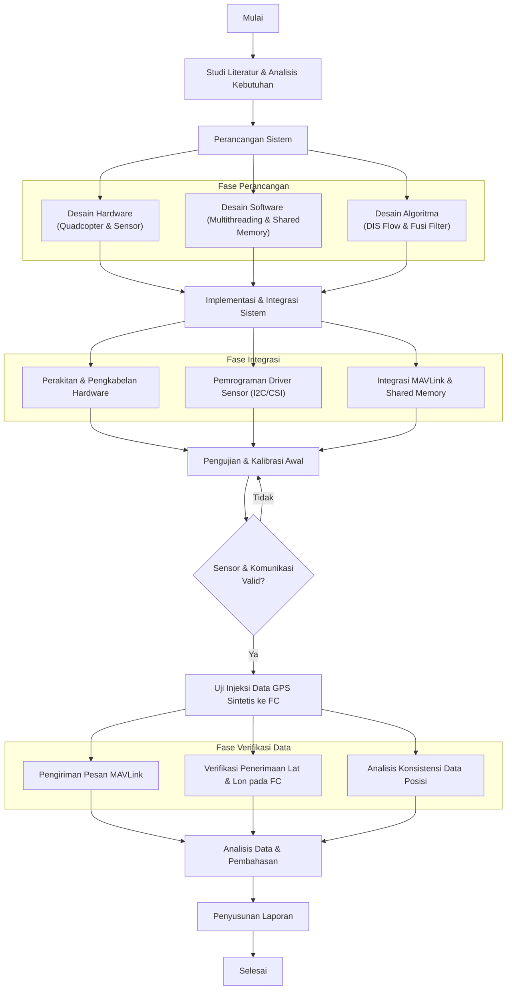
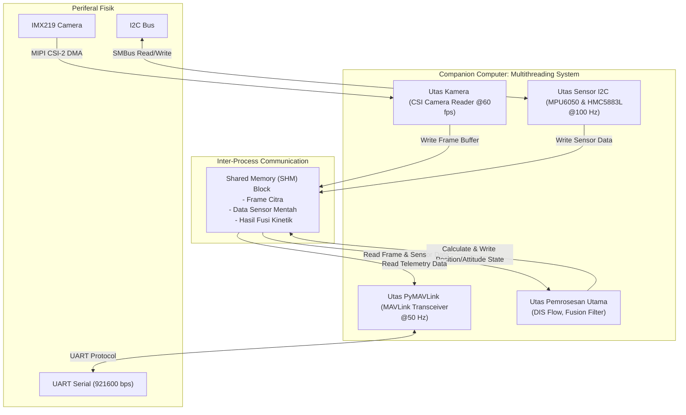
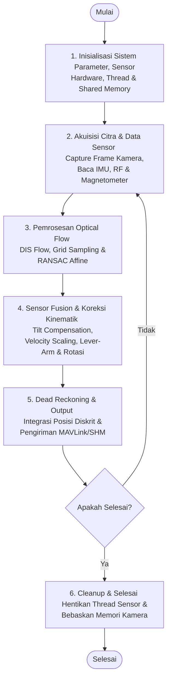
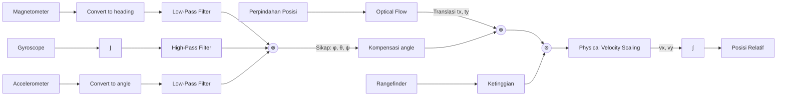

# BAB III: METODOLOGI PENELITIAN

## 3.1. Alur Penelitian (Research Flowchart)

Metodologi penelitian ini mencakup beberapa tahapan sistematis untuk merancang, mengimplementasikan, dan menguji sistem navigasi estimasi posisi dan sikap (*attitude*) drone quadcopter berbasis *optical flow* menggunakan *Companion Computer* Raspberry Pi. Alur penelitian secara menyeluruh ditunjukkan pada **Gambar 3.1**.

<b>Gambar 3.1.</b> Flowchart tahapan metodologi penelitian.

Secara naratif, tahapan-tahapan alur penelitian dimulai dengan fase studi literatur dan analisis kebutuhan. Pada tahap awal ini, penelitian difokuskan pada studi kepustakaan terkait sensor aliran optik (*optical flow*), algoritma estimasi gerak berbasis pemrosesan citra *Dense Inverse Search* (DIS), filter komplementer untuk estimasi orientasi, serta arsitektur antarmuka Raspberry Pi dan *Flight Controller*. Analisis kebutuhan kemudian dilakukan untuk merumuskan spesifikasi minimum perangkat keras (*hardware*) dan perangkat lunak (*software*) agar sistem dapat berjalan secara *real-time*.

Setelah kebutuhan sistem didefinisikan, alur penelitian dilanjutkan ke fase perancangan sistem (*design phase*). Fase ini mencakup desain perangkat keras yang berfokus pada perancangan tata letak penempatan sensor MPU6050, magnetometer HMC5883L, LiDAR TF-Mini, serta kamera 8MP yang diarahkan menghadap ke bawah pada struktur frame quadcopter 3 inci. Selain perancangan fisik, dirancang pula arsitektur perangkat lunak sistem multi-threading di dalam *Companion Computer* untuk menangani beberapa tugas pembacaan sensor secara paralel tanpa menghambat jalannya utas utama pengolahan citra. Di sisi lain, desain algoritma dirancang untuk melakukan fusi data sensor inersia dan kompensasi rotasi (*tilt compensation*) guna memperbaiki estimasi vektor pergeseran piksel dari algoritma DIS *optical flow*.

Tahap selanjutnya adalah fase integrasi sistem (*implementation phase*) yang merealisasikan hasil rancangan. Tahap ini meliputi perakitan fisik seluruh komponen kelistrikan ke papan distribusi daya serta menghubungkan pin komunikasi data seperti I2C, UART, dan MIPI CSI. Pemrograman driver sensor dilakukan dengan menulis kode program berbasis Python untuk komunikasi protokol I2C menggunakan pustaka `SMBus2` dan akuisisi citra kamera melalui modul kamera Raspberry Pi. Integrasi MAVLink juga diselesaikan pada fase ini untuk menyusun protokol pengemasan data posisi dan kecepatan hasil kalkulasi ke dalam paket telemetri MAVLink yang ditransmisikan secara serial dengan *baud rate* sebesar 921600 bps.

Sistem yang telah terintegrasi kemudian masuk ke tahap pengujian dan kalibrasi awal. Pengujian fungsional dasar seluruh sensor dilakukan pada kondisi stasis (diam) untuk merekam nilai bias awal (*offset correction*) dari giroskop dan akselerometer serta memastikan konektivitas serial berjalan lancar. Apabila sensor tidak terdeteksi atau data pembacaan tidak valid, alur proses akan diarahkan kembali ke fase integrasi untuk pemeriksaan pengkabelan fisik maupun pemrograman ulang driver.

Setelah seluruh komponen terkalibrasi dengan valid, fase verifikasi data dilaksanakan melalui simulasi injeksi data statis pada meja uji (*bench test*). Fase verifikasi ini meliputi pengiriman pesan navigasi MAVLink secara berkala dari *Companion Computer* ke *Flight Controller*. Selanjutnya, dilakukan verifikasi langsung pada *Flight Controller* untuk memastikan bahwa data koordinat geografis sintetis berupa garis lintang (*latitude*) dan garis bujur (*longitude*) telah diterima dan diuraikan dengan benar oleh sistem autopilot. Akhirnya, dilakukan analisis konsistensi data posisi untuk mengevaluasi apakah perubahan posisi yang disimulasikan secara optik berkorelasi secara linier terhadap perubahan koordinat GPS sintetis yang dibaca oleh *Flight Controller*.

Penelitian diakhiri dengan tahap analisis data, pembahasan, dan penyusunan laporan. Data komunikasi serial dan penerimaan koordinat pada *Flight Controller* dianalisis untuk mengevaluasi keandalan pengiriman data serta latensi transmisi antar perangkat. Hasil analisis data dan pembahasan tersebut kemudian didokumentasikan secara sistematis ke dalam laporan penelitian akhir sebagai hasil pertanggungjawaban ilmiah.

---

## 3.2. Arsitektur dan Integrasi Sistem

Sistem pada penelitian ini dirancang menggunakan arsitektur terdistribusi yang terdiri dari modul input sensor, modul komputasi utama, modul autopilot, dan modul *output monitoring*. Arsitektur ini bertujuan untuk mendukung proses estimasi posisi horizontal serta injeksi koordinat geografis sintetis (*latitude* dan *longitude*) secara *real-time* untuk simulasi navigasi pada *flight controller* melalui integrasi *sensor fusion* IMU, *optical flow*, dan LiDAR secara statis pada meja uji (*bench test*).

Pada bagian input, sistem memperoleh data dari beberapa sensor utama, yaitu sensor IMU MPU6050 sebagai pembaca percepatan dan kecepatan sudut, sensor magnetometer HMC5883L sebagai pembaca orientasi arah, sensor LiDAR TF-Mini untuk pengukuran jarak terhadap permukaan, serta sensor *gyro onboard* yang terintegrasi pada *flight controller*. Sistem tidak menggunakan modul GPS fisik; sebagai gantinya, koordinat global diperoleh melalui penghitungan estimasi pergerakan dari *optical flow* dan sensor inersia yang dikonversi menjadi data GPS sintetis oleh Raspberry Pi. Data GPS sintetis ini kemudian diinjeksikan ke *flight controller* (FC) melalui komunikasi serial UART untuk mengemulasikan modul GPS NMEA standar pada port GPS *flight controller*. Sensor MPU6050 dan HMC5883L berkomunikasi dengan Raspberry Pi menggunakan protokol I2C, sedangkan sensor LiDAR menggunakan komunikasi serial UART menuju *flight controller*.

Raspberry Pi berperan sebagai *main process compute module* yang menangani pemrosesan data utama. Modul ini menerima data visual dari Raspberry Pi Camera Module v2 (8MP) melalui antarmuka MIPI CSI-2. Data citra kemudian diproses untuk menghasilkan informasi *optical flow* yang digunakan untuk mengestimasi pergerakan horizontal. Selain itu, Raspberry Pi juga berkomunikasi dua arah dengan *flight controller* menggunakan protokol UART (via MAVLink) pada port telemetri untuk pertukaran data sensor dan status navigasi, serta menggunakan port UART terpisah untuk menginjeksikan data koordinat GPS sintetis (*latitude* dan *longitude*) guna mengemulasikan modul GPS NMEA.

*Flight controller* bertugas sebagai unit pengendali tingkat rendah (*low-level control*) yang memproses filter EKF (*Extended Kalman Filter*) internalnya menggunakan data koordinat sintetis yang diinjeksikan sebagai emulasi GPS NMEA pada port GPS. *Flight controller* juga menerima masukan kendali dari ELRS Radio TX menggunakan protokol CRSF (*Crossfire Serial Protocol*) sebagai media komunikasi *remote control* berlatensi rendah untuk simulasi perintah pergerakan.

Pada bagian aktuasi, *flight controller* terintegrasi langsung dengan ESC (*Electronic Speed Controller*) 20A pada satu papan (*All-in-One*). Unit ESC terintegrasi tersebut kemudian melakukan *switching* MOSFET tiga fasa (3-*phase* MOSFET *switching*) untuk mengendalikan motor BLDC DarwinFPV 1504 3600KV. Meskipun pengujian dilakukan secara statis di atas meja uji tanpa penerbangan nyata, respon sinyal aktuasi internal ESC dan putaran motor tetap diamati untuk memvalidasi bahwa perintah kontrol dari *flight controller* merespon perubahan koordinat GPS sintetis yang diinjeksikan secara konsisten.

Pada bagian *output*, Raspberry Pi mengirimkan data hasil pemrosesan melalui jaringan UDP menuju Node Akuisisi Data dan *Ground Control Station* untuk keperluan *monitoring* dan pencatatan data telemetri. Selain itu, video dan visualisasi *optical flow* dikirim menggunakan protokol RTSP menuju Opt Flow HUD untuk menampilkan *footage* yang digunakan untuk proses pengolahan citra *optical flow*.

Sebagai bagian dari subsistem *monitoring* diagnostik berkecepatan tinggi, sistem mengintegrasikan **Dashboard Pemantauan Shared Memory** secara *real-time*. Dashboard ini dikembangkan menggunakan kerangka *Flask Web Server* untuk membaca segmen memori bersama (*shared memory* IPC) pada *Companion Computer* secara asinkron. Beberapa segmen memori utama yang dipantau meliputi data kompas (`compass_heading_stream`), data estimasi pergeseran posisi serta kecepatan aliran optik (`optical_flow_stream`), dan telemetri daya baterai (`battery_status_stream`). Dashboard ini secara interaktif memvisualisasikan data hasil kalkulasi *optical flow* (seperti perpindahan koordinat $X$ dan $Y$, kecepatan laju linier $V_x$ dan $V_y$, serta data ketinggian wahana) untuk mempermudah proses pencarian masalah (*troubleshooting*) apabila terjadi galat pelacakan (*tracking error*), deviasi kalkulasi, atau hilangnya data sensor secara mendadak. Selain itu, dashboard ini memverifikasi kesegaran data (*data freshness*) serta menampilkan representasi heksadesimal (*hex dump*) dari isi *buffer* memori bersama secara langsung untuk mendeteksi integritas byte data sebelum diinjeksikan sebagai emulasi GPS NMEA.

Secara keseluruhan, arsitektur sistem ini mengintegrasikan sensor inersial, sensor jarak, dan pemrosesan citra dalam satu sistem kendali tertutup (*closed-loop system*) untuk memvalidasi keandalan transmisi dan penerimaan estimasi koordinat GPS sintetis (*latitude* dan *longitude*) pada *flight controller* secara akurat dan responsif.

---

## 3.3. Perancangan Sistem

### 3.3.1. Perancangan Perangkat Keras (Hardware Design)

Integrasi sistem perangkat keras menggunakan quadcopter mini sebagai wahana uji. Skema detail dari interkoneksi komponen elektronik telah dijabarkan pada Bab II. Pada bagian ini, spesifikasi fungsional komponen utama dirangkum beserta analisis alokasi berat (*weight budget*) dan analisis gaya angkat wahana.

#### 3.3.1.1. Spesifikasi Teknis Komponen Elektronika
Guna mendukung proses fusi sensor dan perhitungan navigasi otonom secara *real-time*, masing-masing komponen elektronik yang diintegrasikan ke dalam wahana dipilih berdasarkan kriteria performa spesifik. Rincian spesifikasi teknis dan fungsi fungsional dari tiap komponen utama dijabarkan pada **Tabel 3.1**.

<b>Tabel 3.1.</b> Spesifikasi Teknis Komponen Utama Wahana

| No | Nama Komponen / Sensor | Parameter Spesifikasi Teknis Utama | Peran / Fungsi Utama dalam Sistem |
|:--:|:-----------------------|:-----------------------------------|:----------------------------------|
| 1 | *Companion Computer*   (Raspberry Pi 4 Model B) | - Prosesor: Broadcom BCM2711 Quad-core Cortex-A72 @1.5 GHz   - Memori: 4 GB LPDDR4-3200 SDRAM   - *Interface*: GPIO 40-pin, I2C, UART, MIPI CSI-2 | Mengolah algoritma pemrosesan citra *optical flow*, kompensasi rotasi (*tilt compensation*), penyaringan fusi filter komplementer, dan mengelola pertukaran telemetri *MAVLink* dan emulasi GPS *NMEA*. |
| 2 | *Flight Controller* (FC)   (BETAFPV F4 2-3S 20A AIO FC V1) | - MCU: STM32F405RGT6 32-bit ARM Cortex-M4 @168 MHz   - Sensor *Onboard*: Giroskop & Akselerometer ICM42688P, Barometer BMP280/DPS310, Built-in 20A ESC, Built-in ELRS RX   - *Firmware*: Betaflight / ArduPilot | Pengendali kestabilan sikap tingkat rendah (*low-level attitude control*), loop kendali PID, pengaturan daya motor terintegrasi (ESC 20A), pemrosesan filter EKF/internal, serta penyediaan port UART/telemetri. |
| 3 | Kamera Downward   (Pi Camera Module v2) | - Sensor Citra: Sony IMX219 (8 Megapiksel)   - Konfigurasi: 640x480 piksel @60 *fps* (di-*downscale* menjadi 240x240 piksel)   - Koneksi: Kabel pita MIPI CSI-2 | Melakukan akuisisi citra permukaan tanah berkecepatan tinggi secara kontinu untuk dianalisis oleh algoritma DIS *optical flow*. |
| 4 | Sensor Jarak / LiDAR   (TF-Mini Rangefinder) | - Jangkauan: 0.1 m - 12 m   - Akurasi: $\pm 6\text{ cm}$ (pada $<6\text{ m}$), $\pm 1\%$ (pada $>6\text{ m}$)   - Frekuensi: 100 Hz   - Koneksi: UART Serial | Mengukur jarak vertikal wahana ke tanah (*altitude*) untuk memberikan penskalaan metrik kecepatan fisik (*velocity scaling*). |
| 5 | *Inertial Measurement Unit*   (IMU MPU6050) | - Giroskop: $\pm 250, \pm 500, \pm 1000, \pm 2000^\circ/\text{s}$ (16-bit)   - Akselerometer: $\pm 2, \pm 4, \pm 8, \pm 16\text{g}$ (16-bit)   - Koneksi: I2C Bus (`0x68`) | Membaca kecepatan sudut (*gyro*) dan percepatan linier (*accel*) untuk estimasi sudut sikap dan kompensasi rotasi kamera. |
| 6 | *Digital Compass* / Mag   (HMC5883L) | - Sensor: *Anisotropic Magnetoresistive* (AMR) 3-Axis   - Resolusi: 12-bit ADC ($\pm 0.88$ hingga $\pm 8.1$ Gauss)   - Koneksi: I2C Bus (`0x1E`) | Mendeteksi kekuatan medan magnet bumi untuk mengestimasi sudut arah hadap (*heading*) absolut wahana. |
| 7 | Regulator Tegangan   (Step-Down LM2596) | - Tegangan Input: 4.5 V - 40 V DC   - Tegangan Output: 5.0 V DC (Dapat disetel)   - Arus Output Maksimum: 3.0 Ampere | Menurunkan tegangan baterai Li-Ion 3S (11.1V - 12.6V) menjadi 5.0V stabil untuk menyuplai daya ke Raspberry Pi 4. |

#### 3.3.1.2. Tabel Daftar Komponen dan Bobot Wahana
Untuk menganalisis rasio daya terhadap berat (*thrust-to-weight ratio*), dilakukan penimbangan massa komponen sistem yang ditunjukkan pada **Tabel 3.2**.

<b>Tabel 3.2.</b> Estimasi Anggaran Berat (Weight Budget) Drone

| No | Nama Komponen / Modul | Jumlah | Berat per Unit (g) | Total Berat (g) | Persentase (%) |
|:--:|:----------------------|:------:|:------------------:|:---------------:|:--------------:|
| 1 | Frame Quadcopter (3-inch Carbon Fiber) | 1 | 45,0 | 45,0 | 12,6% |
| 2 | Motor Brushless DarwinFPV 1504 3600KV | 4 | 9,4 | 37,6 | 10,5% |
| 3 | Flight Controller AIO (BETAFPV F4 2-3S 20A AIO FC V1) | 1 | 8,5 | 8,5 | 2,4% |
| 4 | Propeler Gemfan F3015 | 4 | 1,4 | 5,6 | 1,6% |
| 5 | Companion Computer (Raspberry Pi 4 - 4GB) | 1 | 46,0 | 46,0 | 12,8% |
| 6 | Raspberry Pi Camera Module v2 (8MP) | 1 | 3,0 | 3,0 | 0,8% |
| 7 | LiDAR TF-Mini (Sensor Ketinggian) | 1 | 4,7 | 4,7 | 1,3% |
| 8 | Sensor IMU MPU6050 + HMC5883L Magnetometer | 1 | 3,5 | 3,5 | 1,0% |
| 9 | Baterai Li-Ion 3S 18650 (2600 mAh) | 1 | 145,0 | 145,0 | 40,5% |
| 10 | Kabel, Konektor, Spacer, dan Dudukan 3D Print | 1 | 59,1 | 59,1 | 16,5% |
| **Total** | **Estimasi Berat Lepas Landas (AUW - All Up Weight)** | | | **358,0 g** | **100,0%** |

#### 3.3.1.3. Analisis Thrust-to-Weight Ratio
Rasio gaya angkat terhadap berat (*Thrust-to-weight ratio* - TWR) merupakan parameter kritis untuk memastikan wahana memiliki kemampuan melayang (*hover*) dan berakselerasi dengan stabil.
* Gaya angkat maksimum ($T_{\text{total}}$) dihasilkan dari 4 buah motor DarwinFPV 1504 dengan propeler Gemfan F3015. 
* Daya motor maksimal per unit = $97,2\text{ W}$. Arus maksimal per motor = $8,1\text{ A}$ pada tegangan baterai penuh $12,6\text{ V}$. Parameter daya ini diperoleh berdasarkan data karakteristik dinamis (*datasheet thrust test*) motor DarwinFPV 1504 dengan beban propeler Gemfan F3015 pada konfigurasi baterai 3S. Di bawah beban throttle penuh, tegangan baterai mengalami penurunan (*voltage sag*) dari nominal penuh $12,6\text{ V}$ menjadi $12,0\text{ V}$ ($4,0\text{ V}$ per sel). Menggunakan persamaan daya listrik $P = V \times I$, diperoleh daya maksimum $P = 12,0\text{ V} \times 8,1\text{ A} = 97,2\text{ W}$ per unit motor.
* Berdasarkan data karakteristik motor, gaya angkat maksimum per motor ($T_{\text{motor}}$) pada putaran penuh ($100\%$ throttle) adalah sekitar $220\text{ g}$.
* Gaya angkat total dari 4 unit motor:
  
  $$T_{\text{total}} = 4 \times T_{\text{motor}} = 4 \times 220\text{ g} = 880\text{ g}$$

* Rasio TWR dihitung menggunakan Persamaan (3.1):
  
  $$\text{TWR} = \frac{T_{\text{total}}}{\text{AUW}} = \frac{880\text{ g}}{358\text{ g}} \approx 2,46 \quad (3.1)$$

> [!NOTE]
> Nilai TWR sebesar **2,46** memenuhi kriteria desain drone multirotor yang ideal (minimal 2,0), sehingga wahana dapat melayang stabil pada tingkat throttle sekitar $40,7\%$ dan masih menyisakan cadangan daya yang memadai untuk melakukan manuver koreksi sikap secara dinamis.

#### 3.3.1.4. Pemetaan dan Penjelasan Sambungan Kabel (*Wiring Diagram*)
Untuk mempermudah visualisasi interkoneksi kelistrikan, jalur transmisi sinyal komunikasi data, serta sistem distribusi daya utama antar modul secara menyeluruh, dirancang skema diagram pengkabelan sirkuit (*wiring diagram*) yang ditunjukkan pada **Gambar 3.3**. Diagram skematik ini menyajikan panduan visual yang komprehensif mengenai keterhubungan fisik antara *pin* *header* GPIO *Companion Computer* Raspberry Pi 4, *port* serial pada unit *Flight Controller*, sensor penunjang sikap navigasi, dan modul regulasi tegangan daya listrik.

<b>Gambar 3.3.</b> Skema rangkaian interkoneksi kelistrikan sistem (*wiring diagram*).

Berdasarkan diagram skematik interkoneksi sistem pada meja uji (*bench test*) tersebut, antarmuka kelistrikan dan jalur komunikasi data antar komponen dikonfigurasi melalui pemetaan *pin* pada Raspberry Pi 4, *Flight Controller* (FC), regulator *step-down* LM2596, sensor kompas HMC5883L, dan sensor LiDAR TF-Mini. Hubungan fisik kabel ini dirangkum secara sistematis pada **Tabel 3.3**.

<b>Tabel 3.3.</b> Spesifikasi Pemetaan Kabel Sistem (*Wiring Diagram Table*)

| No | Komponen Asal | *Pin* / *Port* Asal | Komponen Tujuan | *Pin* / *Port* Tujuan | Protokol / Fungsi | Rincian & Status Jalur |
|:--:|:--------------|:-------------------|:----------------|:---------------------|:------------------|:-----------------------|
| 1 | Raspberry Pi 4 | *Pin* 8 (GPIO14 / TXD0) | *Flight Controller AIO* | *Pad* RX1 | UART (*MAVLink* Telemetri) | Transmisi data dari Pi ke FC (921600 bps) |
| 2 | Raspberry Pi 4 | *Pin* 10 (GPIO15 / RXD0) | *Flight Controller AIO* | *Pad* TX1 | UART (*MAVLink* Telemetri) | Penerimaan data dari FC ke Pi (921600 bps) |
| 3 | Raspberry Pi 4 | *Pin* 27 (ID_SD / GPIO0) | *Flight Controller AIO* | *Pad* RX4 | UART (*Synthetic* NMEA) | Pin TX untuk injeksi GPS sintetis (38400 bps) |
| 4 | Raspberry Pi 4 | *Pin* 28 (ID_SC / GPIO1) | *Flight Controller AIO* | *Pad* TX4 | UART (*Synthetic* NMEA) | Pin RX untuk emulasi komunikasi GPS (38400 bps) |
| 5 | Raspberry Pi 4 | *Pin* 3 (GPIO2 / SDA) | Kompas HMC5883L | *Pin* 4 (SDA) | I2C (*Bus* 0 / *SDA*) | Komunikasi jalur data kompas magnetik |
| 6 | Raspberry Pi 4 | *Pin* 5 (GPIO3 / SCL) | Kompas HMC5883L | *Pin* 3 (SCL) | I2C (*Bus* 0 / *SCL*) | Komunikasi jalur *clock* kompas magnetik |
| 7 | Raspberry Pi 4 | *Pin* 1 (3V3) | Kompas HMC5883L | *Pin* 1 (VCC) | Catu Daya (*Power 3.3V*) | Suplai daya lokal untuk sensor kompas |
| 8 | *Flight Controller AIO* | *Pad* TX6 | LiDAR TF-Mini | *Pin* 2 (RX/SDA Blu) | UART (*Serial* LiDAR) | Jalur perintah kontrol ke sensor jarak |
| 9 | *Flight Controller AIO* | *Pad* RX6 | LiDAR TF-Mini | *Pin* 1 (TX/SCL Yel) | UART (*Serial* LiDAR) | Pembacaan data jarak vertikal dari LiDAR |
| 10 | *Flight Controller AIO* | *Pad* 5V & GND | LiDAR TF-Mini | *Pin* 3 (VCC Red) & 4 (GND Blk) | Catu Daya (*Power 5V*) | Suplai daya dari FC ke sensor LiDAR |
| 11 | Baterai Li-Ion 3S | Terminal V+ & V- | Regulator LM2596 | *Pin* 1 (IN+) & 2 (IN-) | Catu Daya Utama DC | Tegangan input dari baterai 3S (11.1V - 12.6V) |
| 12 | Regulator LM2596 | *Pin* 3 (OUT+) & 4 (OUT-) | Raspberry Pi 4 | *Pin* 2 & 4 (5V0) & 14 (GND) | Catu Daya Sistem (5V / 3A) | Regulasi tegangan stabil untuk Raspberry Pi |
| 13 | Raspberry Pi 4 | *Pin* 4 (5V0) & 6 (GND) | Kipas Aksial (*Axial Fan*)| *Pin* 1 (VCC) & 2 (GND) | Sistem Pendingin | Suplai daya untuk kipas pendingin SoC Pi |

Penjelasan fungsional dari diagram pengkabelan tersebut dibagi menjadi beberapa blok sistem utama:

1. **Blok Komunikasi Telemetri UART1 (*MAVLink*)**: Menghubungkan GPIO14 (TX) dan GPIO15 (RX) Raspberry Pi ke pad UART1 (RX1/TX1) pada *Flight Controller AIO* dengan laju *baud rate* 921600 bps. Jalur ini digunakan untuk pertukaran status telemetri, *arming state*, serta parameter navigasi umum menggunakan protokol *MAVLink*.
2. **Blok Injeksi GPS Sintetis UART4 (*NMEA*)**: Menggunakan pin khusus ID_SD (GPIO0) dan ID_SC (GPIO1) pada Raspberry Pi yang diatur dalam mode alternatif (*ALT4*) untuk mengaktifkan port serial UART2. Pin GPIO0 bertindak sebagai TXD2 yang dihubungkan ke pad RX4 pada *Flight Controller AIO*, sedangkan GPIO1 bertindak sebagai RXD2 yang dihubungkan ke pad TX4 pada *Flight Controller AIO*. Jalur ini khusus mentransmisikan kalimat *synthetic* GPS berformat NMEA 0183 (GPGGA dan GPRMC) pada laju *baud rate* 38400 bps untuk mengemulasikan sensor navigasi satelit.
3. **Blok Sensor Arah I2C (Kompas HMC5883L)**: Dihubungkan ke GPIO2 (SDA) dan GPIO3 (SCL) Raspberry Pi. Jalur ini menggunakan bus I2C internal Raspberry Pi untuk membaca data magnetik bumi secara berkala guna menentukan sudut *heading* wahana. Catu daya sensor diperoleh dari pin 3.3V (Pin 1) Raspberry Pi.
4. **Blok Sensor Jarak UART6 (LiDAR TF-Mini)**: Dihubungkan ke pad UART6 (TX6/RX6) pada *Flight Controller AIO*. Sensor ini membaca jarak vertikal wahana ke permukaan tanah (*rangefinder*) dan mengirimkan datanya langsung ke *Flight Controller AIO*. Informasi ketinggian ini kemudian diteruskan ke Raspberry Pi melalui telemetri *MAVLink* untuk proses penskalaan metrik kecepatan *optical flow*.
5. **Blok Catu Daya (*Power Distribution*)**: Sistem ditenagai oleh baterai Li-Ion 3S. Tegangan baterai diturunkan secara efisien menjadi 5.0 Volt stabil dengan arus maksimal 3.0 Ampere menggunakan regulator *step-down* LM2596 untuk menghidupkan Raspberry Pi 4 melalui pin 5V (Pin 2 dan 4) dan pin *ground* (Pin 14).
6. **Blok Pendingin (*Cooling System*)**: Sebuah kipas aksial (*axial fan*) dihubungkan ke pin 5V (Pin 4) and pin *ground* (Pin 6) Raspberry Pi untuk mendinginkan unit SoC (*System on Chip*) komputer pendamping selama pemrosesan citra *optical flow* berlangsung secara intensif.

#### 3.3.1.5. Perancangan Struktur Frame dan Casing Pelindung

Untuk menunjang integrasi fisik seluruh komponen perangkat keras yang telah diuraikan, dirancang suatu struktur mekanis pelindung berupa rangka (*frame*) dan rumah pelindung (*casing* / *canopy*) menggunakan perangkat lunak Computer-Aided Design (CAD). Desain model 3D CAD wahana quadcopter ditunjukkan pada **Gambar 3.2**.

  

<b>Gambar 3.2.</b> Desain model 3D CAD rangka (*frame*) dan casing pelindung quadcopter.

Perancangan struktur mekanis wahana ini memiliki beberapa karakteristik dan spesifikasi desain sebagai berikut:

1. **Struktur Rangka (*Frame*) Utama**:
   - Rangka menggunakan konfigurasi geometri silang simetris (*True X-geometry*) berukuran diagonal motor-ke-motor sebesar 3 inci untuk menghasilkan keseimbangan gaya angkat (*thrust*) yang merata pada keempat lengan motor.
   - Dilengkapi pelindung baling-baling lingkaran penuh (*integrated ducted propeller guards*) yang menyatu dengan struktur lengan untuk meningkatkan faktor keselamatan (*safety*) saat pengoperasian statis di atas meja uji (*bench test*) serta mengarahkan aliran udara baling-baling ke bawah secara lebih optimal (efek saluran aerodinamis).

2. **Casing Pelindung Kompartemen (*Central Protective Housing*)**:
   - Kompartemen pusat dirancang sebagai *casing* pelindung untuk menutup tumpukan (*stack*) komponen elektronik utama, yang memisahkan area *Companion Computer* Raspberry Pi 4 (pada dek tengah) dan *Flight Controller AIO* (pada dek bawah).
   - Memiliki kisi-kisi atau celah ventilasi udara di sisi samping guna mendukung sirkulasi udara dingin dari kipas pendingin aksial langsung ke komponen prosesor Broadcom BCM2711 dan modul MOSFET regulasi daya.
   - Menyediakan titik penempatan kokoh bagi sensor eksternal (IMU MPU6050 dan kompas HMC5883L) agar terhindar dari kontak fisik langsung.

3. **Dudukan Sensor Arah Bawah (*Downward Sensor Mount*)**:
   - Bagian bawah casing dirancang khusus dengan lubang dudukan presisi untuk mengarahkan lensa Pi Camera Module v2 dan pemancar/penerima inframerah sensor LiDAR TF-Mini tegak lurus mengarah ke permukaan tanah ($90^\circ$ *downward-facing*). Hal ini krusial untuk memastikan algoritma *optical flow* dan *rangefinder* mendapatkan vektor estimasi gerak horizontal dan vertikal yang akurat tanpa mengalami distorsi sudut kemiringan fisik *housing*.

4. **Kaki Pendaratan (*Landing Gear*)**:
   - Memiliki empat kaki pendaratan independen berdesain melebar (*angled landing gear legs*) yang memanjang dari sudut bawah lengan motor. Desain ini bertujuan untuk memberikan kestabilan tinggi saat wahana diletakkan di atas meja pengujian, sekaligus memberikan jarak bebas (*clearance*) vertikal yang cukup (sekitar $5\text{ cm}$) antara permukaan tanah dengan lensa kamera dan sensor LiDAR agar terlindung dari gesekan fisik.

5. **Dudukan Baterai (*Battery Holder*)**:
   - Pada bagian dek atas (*top deck*), dirancang dudukan khusus dengan bentuk kompartemen segitiga untuk menahan posisi baterai Li-Ion 3S tipe 18650 secara kokoh. Posisi ini dipilih agar posisi pusat gravitasi (*Center of Gravity* - CoG) wahana tetap berada di pusat geometri vertikal dan horizontal drone demi kestabilan kendali sikap.

6. **Analisis Pusat Massa (*Center of Mass* / CoM)**:
   - Berdasarkan hasil perhitungan properti fisik pada model 3D CAD, koordinat pusat massa (*Center of Mass*) wahana diperoleh pada titik koordinat:
     $$X = 1,58\text{ mm}, \quad Y = -0,472\text{ mm}, \quad Z = -29,28\text{ mm}$$
   - Nilai penyimpangan sumbu horizontal ($X$ dan $Y$) yang sangat mendekati nol menunjukkan bahwa distribusi berat komponen elektronik, sensor, baterai, dan struktur mekanis telah terdistribusi secara simetris di sekitar sumbu tengah wahana. Hal ini sangat penting untuk meminimalkan beban kerja motor yang tidak seimbang (*unequal motor loading*) selama mempertahankan sikap *hover*.
   - Nilai sumbu vertikal ($Z = -29,28\text{ mm}$) berada di bawah bidang tengah lengan motor, yang memberikan kestabilan mekanis ekstra (efek pendulum) dan membantu meminimalkan momen rotasi liar saat dilakukan manuver koreksi sikap.

---

### 3.3.2. Perancangan Perangkat Lunak (Software Design)

> [!NOTE]
> Penjelasan detail dan arsitektur lengkap mengenai bagian ini dapat diakses pada file khusus: [perancangan_perangkat_lunak.md](file:///e:/OptFlowDrone/OpticalFlowDrone/metode_penelitian/perancangan_perangkat_lunak.md).

Untuk memproses algoritma aliran optik Dense Inverse Search (DIS) dan filter komplementer secara simultan tanpa terjadinya latensi penundaan siklus kontrol, perangkat lunak pada Raspberry Pi dirancang menggunakan arsitektur multi-utas (*multi-threading*) berbasis memori bersama (*shared memory*).

<b>Gambar 3.4.</b> Desain arsitektur data multi-threading dan komunikasi shared memory.

#### 3.3.2.1. Deskripsi Fungsi Utas (Thread Functions)
1. **Utas Kamera (`camera_thread`)**: Mengakses Raspberry Pi Camera Module v2 melalui driver kamera tingkat rendah. Utas ini menyalin bingkai citra beresolusi $640 \times 480$ piksel langsung ke buffer memori bersama pada kecepatan $60\text{ fps}$ secara asinkron.
2. **Utas Sensor I2C (`sensor_thread`)**: Membaca register data internal dari akselerometer/giroskop MPU6050 dan kompas HMC5883L secara berkala dengan frekuensi sampling $100\text{ Hz}$. Data mentah dikonversi menjadi satuan fisik ($\text{m/s}^2$, $\text{rad/s}$, Gauss) sebelum ditulis ke memori bersama.
3. **Utas Pemrosesan Utama (`processing_thread`)**: 
   - Melakukan pra-pemrosesan citra (konversi ke skala abu-abu dan pemotongan/penskalaan ke area minat $240 \times 240$ piksel).
   - Menjalankan algoritma **DIS Optical Flow** untuk menghitung vektor pergeresan piksel rata-rata ($\Delta x, \Delta y$).
   - Membaca data inersia dari memori bersama untuk menjalankan algoritma filter komplementer (*Complementary Filter*) guna mengestimasi sudut *pitch* ($\theta$) dan *roll* ($\phi$).
   - Melakukan kompensasi kemiringan kinetik (*tilt compensation*) pada vektor aliran optik piksel untuk menghilangkan komponen pergeseran akibat rotasi wahana.
   - Mengalikan pergeseran piksel yang bersih dengan ketinggian $h$ dari sensor LiDAR TF-Mini untuk memperoleh kecepatan linier fisik dalam meter per detik ($v_x, v_y$).
 4. **Utas MAVLink (`mavlink_thread`)**: Berkomunikasi dua arah dengan Flight Controller melalui port UART serial. Utas ini membaca data estimasi posisi dan kecepatan dari memori bersama, membungkusnya ke dalam struktur paket pesan MAVLink (misalnya `VISION_POSITION_ESTIMATE` atau `OPTICAL_FLOW_RAD`), dan mentransmisikannya ke Flight Controller secara berkala dengan frekuensi $50\text{ Hz}$.

#### 3.3.2.2. Diagram Alir (*Flowchart*)

Untuk menggambarkan tahapan eksekusi logis dan sekuensial dari pemrosesan data navigasi yang berjalan di dalam *Companion Computer*, dirancang suatu diagram alir pemrosesan data (*data processing flowchart*) sebagaimana ditunjukkan pada **Gambar 3.5**.

<b>Gambar 3.5.</b> Diagram alir pemrosesan data sistem navigasi (*data processing flowchart*).

Secara operasional, eksekusi diagram alir pemrosesan data diawali dengan tahap inisialisasi sistem, di mana parameter komputasi diatur, koneksi fisik seluruh komponen *hardware* (IMU, kompas, LiDAR, dan kamera) diverifikasi, serta segmen memori bersama (*shared memory*) dialokasikan untuk meluncurkan utas-utas (*threads*) pekerja latar belakang. Setelah sistem siap, program masuk ke dalam *loop* utama yang diawali dengan akuisisi citra dan data sensor. Pada tahap ini, bingkai citra (*capture frame*) dari kamera diambil secara asinkron, sementara data inersia dari MPU6050, hadap magnetik dari HMC5883L, dan ketinggian dari LiDAR (*rangefinder*) dibaca secara berkala.

Selanjutnya, data citra yang telah diakuisisi dikirim ke modul pemrosesan *optical flow* untuk menghitung pergeseran piksel antarbingkai menggunakan metode *Dense Inverse Search* (DIS) yang dipadukan dengan pengambilan sampel kisi (*grid sampling*) serta estimasi transformasi afinitas (*RANSAC Affine*). Vektor pergeseran piksel yang dihasilkan kemudian diproses pada tahap fusi sensor dan koreksi kinematik. Di sini, efek rotasi wahana dieliminasi dari aliran optik menggunakan estimasi sudut sikap giroskop (*tilt compensation*), kecepatannya dikonversi ke satuan metrik fisik (*velocity scaling*) dengan parameter tinggi LiDAR, serta dikoreksi terhadap posisi sensor terhadap titik berat (*lever-arm*) dan orientasi hadap (*rotation matrix*).

Setelah diperoleh kecepatan fisik yang presisi, sistem melakukan proses *dead reckoning* dan *output* dengan mengintegrasikan nilai kecepatan terhadap waktu (*discrete position integration*) untuk melacak koordinat relatif wahana. Koordinat global sintetis ini kemudian diformat menjadi pesan NMEA dan paket telemetri *MAVLink* untuk diinjeksikan secara serial ke *Flight Controller*, serta diperbarui ke segmen memori bersama (*shared memory* / SHM) untuk visualisasi *dashboard*. Siklus akuisisi hingga transmisi data ini terus berulang hingga program dihentikan oleh pengguna. Saat sistem menerima perintah untuk selesai, tahap *cleanup* dijalankan dengan menghentikan semua utas pekerja latar belakang (*background threads*), menutup deskriptor memori bersama, membebaskan memori akses kamera, dan menutup program dengan aman.

---

### 3.3.3. Perancangan Algoritma Estimasi Navigasi (Algorithm Design)

#### 3.3.3.1. Diagram Blok Sistem Navigasi (*Control Block Diagram*)

Untuk memberikan gambaran menyeluruh mengenai hubungan timbal-balik antar-komponen sensor, proses pemfilteran, dan fusi data dalam mengestimasi sikap dan posisi wahana, dirancang suatu diagram blok sistem navigasi (*control block diagram*) yang ditunjukkan pada **Gambar 3.6**.

<b>Gambar 3.6.</b> Diagram blok fusi sensor dan estimasi posisi (*control block diagram*).

Alur diagram blok kontrol fusi sensor di atas menggambarkan bagaimana setiap sensor fisik berkontribusi dalam kalkulasi navigasi. Pada jalur estimasi sikap (*attitude estimation*), sensor magnetometer mengonversi pembacaan medan magnet menjadi arah hadap (*convert to heading*), sensor giroskop mengintegrasikan kecepatan sudut terhadap waktu (*integrator* $\int$) untuk mengestimasi orientasi sudut dinamis, dan sensor akselerometer mendeteksi percepatan gravitasi untuk diubah menjadi sudut kemiringan statis (*convert to angle*). Sebelum disatukan, data magnetometer dan akselerometer dilewatkan pada penyaring lolos rendah (*low-pass filter*) untuk meredam derau frekuensi tinggi, sedangkan data integrasi giroskop dilewatkan pada penyaring lolos tinggi (*high-pass filter*) untuk mengeliminasi hanyutan (*drift*) frekuensi rendah. Ketiga informasi sudut sikap ini kemudian difusikan pada simpul penjumlahan ($\otimes$) untuk menghasilkan estimasi sudut sikap wahana yang stabil, meliputi *roll* ($\phi$), *pitch* ($\theta$), dan *yaw* ($\psi$).

Di sisi lain, pemrosesan citra kamera mendeteksi perpindahan posisi visual untuk menghasilkan translasi piksel ($t_x, t_y$) melalui modul *optical flow*. Sudut sikap hasil fusi kemudian dimasukkan ke dalam modul kompensasi sudut (*tilt compensation*) untuk dikombinasikan dengan data translasi piksel guna mengeliminasi efek pergerakan rotasi pada kamera. Selanjutnya, data pergeseran piksel yang bersih dari rotasi dikalikan dengan parameter ketinggian ($h$) dari sensor LiDAR (*rangefinder*) pada simpul pencampuran berikutnya. Hasil penggabungan ini dimasukkan ke dalam modul penskalaan kecepatan fisik (*physical velocity scaling*) untuk dikonversi menjadi unit kecepatan linier fisik dalam meter per detik ($v_x, v_y$). Terakhir, kecepatan fisik ini dilewatkan ke modul integrator ($\int$) terhadap selang waktu untuk menghasilkan estimasi posisi relatif wahana terhadap titik awal operasi secara *real-time*.

#### 3.3.3.2. Algoritma Fusi Sikap (Complementary Filter)
Filter komplementer digunakan untuk menggabungkan data giroskop (integrasi cepat namun memiliki *drift* jangka panjang) dan data akselerometer (stabil jangka panjang namun rentan noise frekuensi tinggi). Formulasi matematis untuk estimasi sudut sikap $\theta_{k}$ (pitch) pada langkah ke-$k$ ditunjukkan pada Persamaan (3.2):

$$\theta_{k} = \alpha \cdot (\theta_{k-1} + \omega_{y} \cdot \Delta t) + (1 - \alpha) \cdot \theta_{\text{acc}} \quad (3.2)$$

Di mana $\theta_{\text{acc}}$ dihitung berdasarkan pembacaan akselerometer melalui Persamaan (3.3):

$$\theta_{\text{acc}} = \operatorname{atan2}(a_x, \sqrt{a_y^2 + a_z^2}) \quad (3.3)$$

*   $\alpha$ = koefisien bobot filter komplementer (ditentukan sebesar **0.98** melalui kalibrasi empiris).
*   $\omega_{y}$ = laju rotasi sudut sumbu-Y dari giroskop ($\text{rad/s}$).
*   $\Delta t$ = interval waktu sampling ($0,01\text{ s}$).
*   $a_x, a_y, a_z$ = komponen percepatan linier dari akselerometer ($\text{m/s}^2$).

#### 3.3.3.3. Kompensasi Rotasi Aliran Optik (Tilt Compensation)
Aliran optik mentah ($\Delta x_{\text{raw}}, \Delta y_{\text{raw}}$) yang terdeteksi oleh kamera mengalami bias pergeseran akibat adanya gerakan rotasi (kemiringan) wahana. Agar diperoleh translasi linier murni, dilakukan kompensasi rotasi menggunakan laju rotasi giroskop ($\omega_{x}, \omega_{y}$) dan panjang fokus lensa ($f_x, f_y$ dalam piksel) berdasarkan Persamaan (3.4) dan (3.5):

$$\Delta x_{\text{comp}} = \Delta x_{\text{raw}} - (f_x \cdot \omega_{y} \cdot \Delta t) \quad (3.4)$$

$$\Delta y_{\text{comp}} = \Delta y_{\text{raw}} + (f_y \cdot \omega_{x} \cdot \Delta t) \quad (3.5)$$

#### 3.3.3.4. Penskalaan Kecepatan Fisik (Metric Velocity Scaling)
Setelah diperoleh pergeseran piksel yang terkompensasi, kecepatan translasi fisik drone ($v_x, v_y$) dihitung dengan mengalikan pergeseran piksel terhadap rasio ketinggian wahana ($h$) dari tanah yang diperoleh dari sensor LiDAR TF-Mini terhadap parameter kalibrasi kamera, sesuai Persamaan (3.6) dan (3.7):

$$v_x = \frac{\Delta x_{\text{comp}} \cdot h}{f_x \cdot \Delta t} \quad (3.6)$$

$$v_y = \frac{\Delta y_{\text{comp}} \cdot h}{f_y \cdot \Delta t} \quad (3.7)$$

---

## 3.4. Prosedur Pengujian dan Evaluasi

Pengujian sistem dilakukan secara bertahap menggunakan metode pengujian meja (*bench test*) stasis dan dinamis terpandu tanpa uji terbang nyata:

1. **Kalibrasi Sensor Stasis**: Drone diletakkan pada permukaan datar horizontal untuk merekam nilai bias *offset* giroskop dan akselerometer guna melakukan kompensasi kesalahan statis pada filter komplementer.
2. **Uji Linieritas LiDAR**: Sensor jarak TF-Mini diuji pada variasi ketinggian $0,5\text{ m}$ hingga $2,5\text{ m}$ dengan pembanding mistar ukur standar untuk menghitung nilai simpangan (*error*) absolut pembacaan jarak.
3. **Uji Akurasi Algoritma Aliran Optik**: Kamera digerakkan secara manual di atas pola tekstur permukaan tanah yang terkalibrasi. Hasil estimasi pergeseran piksel dari algoritma DIS kemudian dievaluasi terhadap pergeseran fisik aktual untuk menentukan konstanta piksel-ke-meter.
4. **Uji Injeksi Koordinat MAVLink (Bench Test)**: Menguji integrasi pengiriman koordinat sintetis dari Raspberry Pi ke *Flight Controller*. Pengujian ini dinyatakan berhasil apabila *Flight Controller* dapat menerima, mengenali, dan menampilkan koordinat posisi berupa garis lintang (*latitude*) dan garis bujur (*longitude*) secara *real-time* melalui stasiun pengendali darat (*Ground Control Station* - GCS) tanpa adanya kehilangan paket data (*packet loss*).
