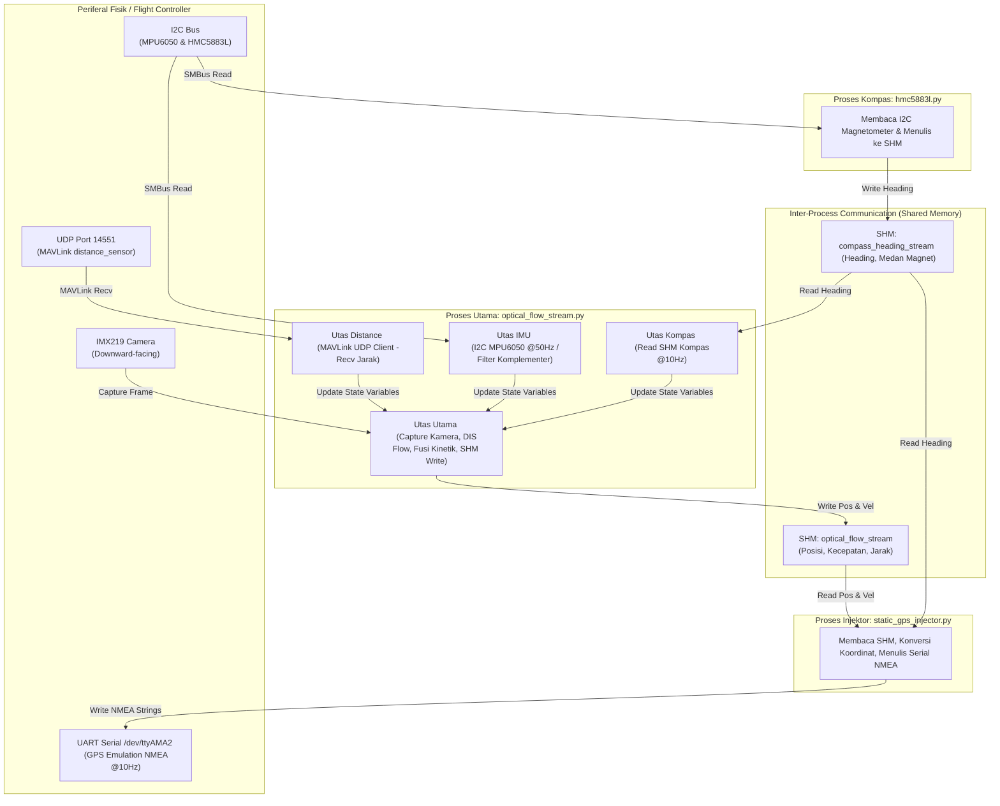
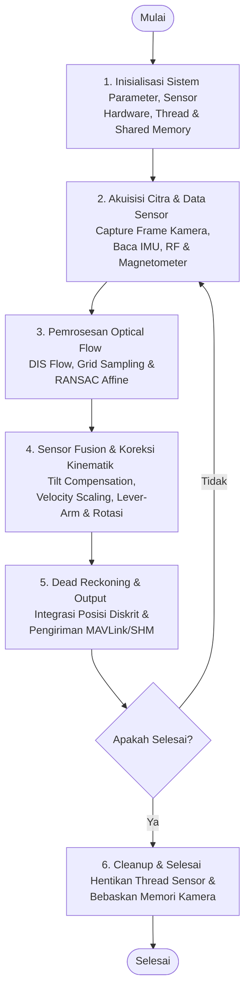

# Perancangan Perangkat Lunak (Software Design)

Dokumen ini menjelaskan metodologi perancangan perangkat lunak yang dijalankan pada *Companion Computer* Raspberry Pi untuk sistem navigasi otonom berbasis *optical flow*.

Untuk memproses algoritma aliran optik Dense Inverse Search (DIS) dan fusi filter sikap secara *real-time* tanpa latensi penundaan siklus kontrol, arsitektur perangkat lunak dirancang menggunakan sistem multi-proses (*multi-processing*) yang saling bertukar data secara asinkron menggunakan blok memori bersama (*shared memory*).

---

## 1. Arsitektur Multi-Proses dan Komunikasi Shared Memory

Sistem perangkat lunak dibagi menjadi tiga proses Python mandiri yang berjalan secara paralel di bawah *Companion Computer*. Pembagian tugas ini mengisolasi proses akuisisi visual, pembacaan kompas magnetik, dan injeksi GPS koordinat ke *Flight Controller*.

<b>Gambar 1.</b> Arsitektur multi-proses, multi-threading, dan interaksi hardware.

---

## 2. Deskripsi Fungsi Proses dan Utas (Process & Thread Functions)

Pembagian tugas pemrosesan dan utas latar belakang dirinci pada **Tabel 1**.

<b>Tabel 1.</b> Deskripsi Fungsi Proses dan Utas Utama

| No | Modul / Utas | Tipe | Deskripsi Fungsi & Alur Kerja |
|:--:|:-------------|:----:|:------------------------------|
| 1 | **Proses `optical_flow_stream.py`** | Proses | Program utama pengolahan citra otonom dan fusi sensor pendukung. |
| - | Utas Utama | Utas | Mengakuisisi frame kamera $640 \times 480$ @60 fps, menghitung DIS Flow, fusi filter komplementer, kompensasi rotasi, penskalaan kecepatan, dan menulis data ke SHM `optical_flow_stream`. |
| - | Utas IMU (`imu_thread`) | Utas | Membaca akselerometer dan giroskop MPU6050 via I2C (@50 Hz) untuk estimasi sudut *pitch* & *roll*. |
| - | Utas Distance (`distance_thread`) | Utas | Membaca data jarak sensor LiDAR via paket `DISTANCE_SENSOR` MAVLink UDP (`127.0.0.1:14551`). |
| - | Utas Kompas (`compass_thread`) | Utas | Membaca data arah hadap (*heading*) terfilter dari SHM `compass_heading_stream`. |
| 2 | **Proses `hmc5883l.py`** | Proses | Membaca sensor kompas HMC5883L via I2C (@10 Hz) dan menulis *heading* terfilter ke SHM `compass_heading_stream`. |
| 3 | **Proses `static_gps_injector.py`** | Proses | Mengubah data SHM perpindahan relatif menjadi koordinat geografis global, lalu menginjeksikannya sebagai emulasi GPS NMEA via UART serial (@10 Hz). |

---

## 3. Diagram Alir Pemrosesan Data (Data Processing Flowchart)

Tahapan eksekusi logis dan sekuensial dari pemrosesan data navigasi yang berjalan di dalam *Companion Computer* ditunjukkan pada **Gambar 2**.

<b>Gambar 2.</b> Diagram alir pemrosesan data sistem navigasi.

### Penjelasan Tahapan Diagram Alir

Alur pemrosesan data secara sistematis dan bertahap dari diagram alir di atas dijabarkan pada **Tabel 2**.

<b>Tabel 2.</b> Penjelasan Tahapan Alur Pemrosesan Data Navigasi

| No | Tahap | Deskripsi Operasional |
|:--:|:------|:----------------------|
| 1 | Inisialisasi Sistem | Mengatur parameter komputasi, memverifikasi koneksi hardware (IMU, kompas, LiDAR, kamera), mengalokasikan memori bersama, dan menjalankan utas latar belakang. |
| 2 | Akuisisi Citra & Data | Mengambil bingkai citra kamera secara asinkron (`camera_thread`) serta membaca data sensor inersia (MPU6050), arah kompas (HMC5883L), dan ketinggian (LiDAR) secara periodik. |
| 3 | Pemrosesan Optical Flow | Menghitung pergeseran piksel antarbingkai menggunakan algoritma *Dense Inverse Search* (DIS) yang dipadukan dengan grid sampling dan estimasi transformasi afinitas (RANSAC Affine). |
| 4 | Fusi Sensor & Koreksi | Mengeliminasi efek rotasi/kemiringan dari aliran optik (*tilt compensation*), melakukan penskalaan metrik (*velocity scaling*), serta mengoreksi offset *lever-arm* dan rotasi orientasi. |
| 5 | Dead Reckoning & Output | Mengintegrasikan kecepatan terhadap waktu untuk melacak koordinat relatif, memformat data ke pesan MAVLink/NMEA untuk dikirim ke Flight Controller, dan memperbarui memori bersama. |
| 6 | Cleanup | Menghentikan seluruh utas latar belakang dengan aman, menutup deskriptor memori bersama, dan membebaskan alokasi memori kamera sebelum program selesai. |

---

## 4. Komunikasi Data (Data Communication)

Sistem navigasi ini mengintegrasikan berbagai saluran komunikasi data baik internal (Inter-Process Communication) maupun eksternal (sensor dan Flight Controller) yang dirangkum pada **Tabel 3**.

<b>Tabel 3.</b> Saluran Komunikasi Data Sistem

| No | Antarmuka / Saluran | Protokol | Frekuensi / Baudrate | Arah Data | Deskripsi Fungsi |
|:--:|:--------------------|:---------|:---------------------|:---------:|:-----------------|
| 1 | I2C Bus (`/dev/i2c-1`) | Register I2C | $100\text{ Hz}$ | Input | Akuisisi data inersia dari IMU MPU6050 (alamat `0x68`). |
| 2 | I2C Bus (`/dev/i2c-1`) | Register I2C | $10\text{ Hz}$ | Input | Akuisisi data magnetik/arah hadap dari kompas HMC5883L (alamat `0x1E`). |
| 3 | MAVLink UDP Port | UDP (`127.0.0.1:14551`) | Pengiriman otonom | Input | Membaca jarak ketinggian dari sensor LiDAR TF-Mini melalui pesan `DISTANCE_SENSOR` dari Flight Controller. |
| 4 | UART Serial (`/dev/ttyAMA2`) | NMEA Sentences | $10\text{ Hz}$ / 38400 bps | Output | Injeksi data GPS sintetis (`GPGGA`, `GPRMC`, `GPGSA`, `GPHDT`) ke port GPS Flight Controller. |
| 5 | Shared Memory IPC | RAM Block (Buffer) | Akses asinkron | Bidireksional | Pertukaran data real-time antar-proses (`optical_flow_stream` & `compass_heading_stream`). |
| 6 | UDP Command Listener | UDP (`127.0.0.1:5009`) | Sesuai permintaan | Input | Penerimaan perintah kendali eksternal seperti `reset` dan `offset`. |

### 4.1. Struktur Memori Bersama (Shared Memory Structure)

Pertukaran data berkecepatan tinggi antar-proses dijembatani oleh dua blok memori bersama yang dialokasikan di RAM. Struktur byte untuk header dan rekaman data masing-masing blok dirinci pada **Tabel 4** dan **Tabel 5**.

<b>Tabel 4.</b> Tata Letak Memori Bersama `compass_heading_stream` (Format Header: `<4sII`, Record: `<6d`)

| Bagian | Nama Variabel | Tipe Data | Format Struct | Deskripsi |
|:-------|:--------------|:----------|:-------------:|:----------|
| **Header** | Magic Header | char[4] | `4s` | Identifikasi unik blok data (nilai: `CHDG`). |
| **Header** | Write Index | unsigned int | `I` | Indeks ring-buffer untuk penulisan sampel berikutnya. |
| **Header** | Sample Count | unsigned int | `I` | Jumlah total sampel aktif dalam buffer (Maksimum 120). |
| **Record** | `timestamp` | double | `d` | Waktu pencatatan sistem (*epoch timestamp*). |
| **Record** | `raw_heading` | double | `d` | Sudut hadap magnetometer mentah sebelum difilter (derajat). |
| **Record** | `heading` | double | `d` | Sudut hadap magnetometer terfilter setelah fusi IMU (derajat). |
| **Record** | `x` | double | `d` | Kuat medan magnetik mentah sumbu-X. |
| **Record** | `y` | double | `d` | Kuat medan magnetik mentah sumbu-Y. |
| **Record** | `z` | double | `d` | Kuat medan magnetik mentah sumbu-Z. |

<b>Tabel 5.</b> Tata Letak Memori Bersama `optical_flow_stream` (Format Header: `<4sII`, Record: `<11d`)

| Bagian | Nama Variabel | Tipe Data | Format Struct | Deskripsi / Satuan |
|:-------|:--------------|:----------|:-------------:|:-------------------|
| **Header** | Magic Header | char[4] | `4s` | Identifikasi unik blok data (nilai: `FLOW`). |
| **Header** | Write Index | unsigned int | `I` | Indeks ring-buffer untuk penulisan sampel berikutnya. |
| **Header** | Sample Count | unsigned int | `I` | Jumlah total sampel aktif dalam buffer (Maksimum 120). |
| **Record** | `timestamp` | double | `d` | Waktu pencatatan sistem (*epoch timestamp*). |
| **Record** | `x_cm` | double | `d` | Estimasi koordinat posisi $X$ terkompensasi (cm). |
| **Record** | `y_cm` | double | `d` | Estimasi koordinat posisi $Y$ terkompensasi (cm). |
| **Record** | `x_raw_cm` | double | `d` | Estimasi koordinat posisi $X$ mentah tanpa kompensasi (cm). |
| **Record** | `y_raw_cm` | double | `d` | Estimasi koordinat posisi $Y$ mentah tanpa kompensasi (cm). |
| **Record** | `vx` | double | `d` | Kecepatan linier sumbu-X terkompensasi (m/s). |
| **Record** | `vy` | double | `d` | Kecepatan linier sumbu-Y terkompensasi (m/s). |
| **Record** | `vx_raw` | double | `d` | Kecepatan linier sumbu-X mentah tanpa kompensasi (m/s). |
| **Record** | `vy_raw` | double | `d` | Kecepatan linier sumbu-Y mentah tanpa kompensasi (m/s). |
| **Record** | `alt` | double | `d` | Jarak ketinggian wahana dari tanah dari LiDAR (meter). |
| **Record** | `heading` | double | `d` | Arah hadap sudut yaw aktual drone (derajat). |

### 4.2. Format Injeksi Emulasi GPS (Serial GPS Emulation Format)

Data posisi relatif ($x, y$ dalam meter) yang dikalkulasi dari aliran optik dikonversikan menjadi koordinat global (lintang/bujur) berbasis koordinat asal di Bandung ($\text{Lat} = -6.9175$, $\text{Lon} = 107.6191$). Data ini ditransmisikan dalam format NMEA standar berikut:

- **`$GPGGA`**: Mengirimkan data posisi global sintetis terkompensasi (lintang, bujur, kualitas fix `4` / RTK Fixed, jumlah satelit `30`, nilai HDOP `0.1`, dan ketinggian altitude dari LiDAR).
- **`$GPRMC`**: Mengirimkan data koordinat global penentu arah (*minimum recommended data*) beserta status navigasi aktif (`A`), tanggal, dan kecepatan linier.
- **`$GPGSA`**: Mengirimkan faktor pengenceran presisi (PDOP, HDOP, VDOP) untuk meyakinkan Extended Kalman Filter (EKF) Flight Controller terhadap akurasi data.
- **`$GPHDT`**: Mengirimkan informasi hadap sensor magnetik (*true heading*) yang diperoleh dari shared memory kompas.
