# Process & File Dependencies Documentation

This document provides a detailed breakdown of all python scripts, internal modules, configuration files, web assets, data logs, and hardware interfaces involved in the `manage_services.sh` pipeline for the Optical Flow Drone system.

---

## Architecture Overview

```mermaid
graph TD
    A[manage_services.sh]

    %% ── Process Launch ────────────────────────────────────────────────
    A --> B[hmc5883l.py]
    A --> C[optical_flow_stream.py]
    A --> D[geofence_buzzer_listener.py]
    A --> E[send_attitude_udp.py]
    A --> F[web_server.py]

    %% ── hmc5883l.py ──────────────────────────────────────────────────
    B <-->|I2C Bus 1 addr 0x1E| B_HW["HMC5883L Magnetometer\n(Hardware Sensor)"]
    B -->|Read/Write| B1[compass_zero_offset.json]
    B -->|Flask render_template| B2["templates/compass_dashboard.html"]
    B -->|Write: heading, x, y, z, timestamp| SHM1[("SHM: compass_heading_stream")]

    %% ── optical_flow_stream.py ───────────────────────────────────────

    C -->|Write session log| C2["recordings/optical_flow_session_*.csv"]
    C -->|Read frames| C_CAM["PiCamera2\n(Raspberry Pi Camera)"]
    C <-->|I2C Bus 1 addr 0x68| C_IMU["MPU6050 IMU\n(Accel + Gyro)"]
    C -->|UDP recv: commands reset/offset/toggle Port 5009| C_CMD["UDP 127.0.0.1:5009\n(Command Listener)"]
    C -->|Read compass heading| SHM1
    C -->|Write: attitude roll/pitch/yaw/gyro rates| SHM2[("SHM: drone_attitude_stream")]
    C -->|Write: x_cm, y_cm, vx, vy, alt, heading| SHM3[("SHM: optical_flow_stream")]
    C -->|Stream mode: raw frames via stdin pipe| C_FFMPEG["ffmpeg subprocess\n(H.264 encoder)"]
    C_FFMPEG -->|RTSP publish rtsp://127.0.0.1:8554/drone| C_MEDIAMTX["MediaMTX RTSP Server\n(.tools/mediamtx/mediamtx)"]
    C_MEDIAMTX -->|Write log| C3["logs/mediamtx.log"]
    C -->|Record mode: write MP4| C4["recordings/optical_flow_*.mp4"]

    %% ── send_attitude_udp.py ─────────────────────────────────────────
    E -->|Read: roll, pitch, yaw, gyro rates| SHM2
    E -->|Read: x_cm, y_cm, vx, vy, alt, heading| SHM3
    E -->|Read NMEA GGA/RMC sentences| E_GPS["/dev/ttyAMA2\n(Hardware GPS UART)"]
    E -->|Import SensorFusionEngine| E2[sensor_fusion.py]
    E -->|JSON UDP Port 5005: rotation, translation,\nGPS, fused_gps, heading| F

    %% ── web_server.py ────────────────────────────────────────────────
    F -->|Serve static files| F1["web/index.html"]
    F -->|Serve static files| F2["web/app.js"]
    F -->|Serve static files| F3["web/style.css"]
    F -->|Scan & read CSV session logs| F4["recordings/ &\nhasil_dan_pembahasan/\n*.csv"]
    F -->|Read NMEA GGA/RMC sentences fallback| F_GPS["/dev/ttyAMA2\n(Hardware GPS UART)"]
    F -->|SSE stream: telemetry JSON 50 Hz| F_BROWSER["Browser Client\n(Dashboard UI)"]
    F_BROWSER -->|POST /api/geofence/status breached=true/false| F
    F -->|UDP BREACH / SAFE payload Port 5006| D


    %% ── geofence_buzzer_listener.py ──────────────────────────────────
    D -->|Listens UDP Port 5006: BREACH / SAFE packets| D
    D -->|PWM 2300 Hz via gpiozero native\nor python3 -c subprocess fallback| D1["GPIO Pin 12\n(Physical Buzzer Hardware)"]
```

---

## Process Breakdown & File Dependencies

### 1. `hmc5883l.py`
HMC5883L Magnetometer / Compass sensor daemon and calibration web server.

* **Hardware I/O:**
  * `I2C Bus 1, addr 0x1E` – Reads raw X/Y/Z magnetic field samples from the HMC5883L sensor directly via `smbus2`.
* **Configuration Files (Read / Written):**
  * [`compass_zero_offset.json`](file:///e:/OptFlowDrone/OpticalFlowDrone/compass_zero_offset.json) – Persists and loads the user-calibrated heading zero offset.
* **Web Template (Flask dashboard):**
  * [`templates/compass_dashboard.html`](file:///e:/OptFlowDrone/OpticalFlowDrone/templates/compass_dashboard.html) – Rendered on `/` endpoint for the live compass calibration UI.
* **Shared Memory IPC (Producer):**
  * `compass_heading_stream` – Posix Shared Memory circular buffer; writes `timestamp, raw_heading, heading, x, y, z` at sensor rate. **Consumed by `optical_flow_stream.py`** (via `optical_flow/sensor_readers.py`).
* **Log Output:** `$LOG_DIR/hmc5883l.log`

---

### 2. `optical_flow_stream.py`
High-priority optical flow camera capture, IMU fusion, and position tracking daemon.

#### Internal Submodules Imported
| Module | Purpose |
|---|---|
| [`optical_flow/sensor_readers.py`](file:///e:/OptFlowDrone/OpticalFlowDrone/optical_flow/sensor_readers.py) | I2C MPU6050 reader, Compass SHM reader, attitude SHM writer |
| [`optical_flow/flow_processor.py`](file:///e:/OptFlowDrone/OpticalFlowDrone/optical_flow/flow_processor.py) | Dense optical flow estimation, velocity & position state |
| [`optical_flow/hud_renderer.py`](file:///e:/OptFlowDrone/OpticalFlowDrone/optical_flow/hud_renderer.py) | HUD / OSD overlay rendering onto video frames |
| [`optical_flow/video_sinks.py`](file:///e:/OptFlowDrone/OpticalFlowDrone/optical_flow/video_sinks.py) | FileSink (MP4), RtspSink (ffmpeg pipe), DummySink (headless) |

#### Data Communications
* **Hardware Sensors (via `sensor_readers.py`):**
  * `PiCamera2` – Captures raw video frames at 60 FPS.
  * `I2C Bus 1, addr 0x68 (MPU6050)` – Reads accelerometer (X/Y/Z) and gyroscope (X/Y/Z) raw samples; applies complementary filter to produce roll/pitch/yaw.
* **Shared Memory IPC (Consumer & Producer):**
  * `compass_heading_stream` ← **Reads** latest compass heading from `hmc5883l.py` to fuse into yaw estimation.
  * `drone_attitude_stream` → **Writes** roll, pitch, yaw, gyro rates (X/Y/Z) at ~50 Hz.
  * `optical_flow_stream` → **Writes** x_cm, y_cm, raw_x_cm, raw_y_cm, vx, vy, alt, heading at 60 Hz. **Consumed by `send_attitude_udp.py`**.
* **UDP Command Listener:**
  * `UDP 127.0.0.1:5009` – Accepts text commands: `reset` (zero position), `toggle` (switch flow/accel source).

* **Video Output (mode-dependent):**
  * **Record mode** → `recordings/optical_flow_<timestamp>.mp4` (via `cv2.VideoWriter` FileSink).
  * **RTSP stream mode** → Spawns `ffmpeg` subprocess piped raw BGR frames → H.264 encode → publishes to `rtsp://127.0.0.1:8554/drone` on MediaMTX RTSP server (`.tools/mediamtx/mediamtx`). MediaMTX logs to `logs/mediamtx.log`.
  * **Headless mode** → No video encoding (`DummySink`).
* **CSV Session Log:**
  * `recordings/optical_flow_session_<timestamp>.csv` – When `--csv` flag or record mode active; columns include timestamp, X/Y position, velocities, altitude, roll/pitch/yaw, heading, gyro Z, accel X/Y, and inlier count.
* **Log Output:** `$LOG_DIR/optical_flow_stream.log`

---

### 3. `send_attitude_udp.py`
Telemetry bridge: reads all SHM segments, fuses data, and streams JSON UDP packets to the web server.

* **Shared Memory IPC (Consumer):**
  * `drone_attitude_stream` ← Reads latest roll, pitch, yaw, gyro rates written by `optical_flow_stream.py`.
  * `optical_flow_stream` ← Reads latest x_cm, y_cm, vx, vy, altitude, heading written by `optical_flow_stream.py`.
* **Hardware GPS Serial:**
  * `/dev/ttyAMA2` @ 9600 baud – Reads NMEA GGA and RMC sentences (parsed via `pynmea2`) for raw GPS lat/lon/alt/speed/satellites.
* **Python Module Dependencies:**
  * [`sensor_fusion.py`](file:///e:/OptFlowDrone/OpticalFlowDrone/sensor_fusion.py) – `SensorFusionEngine`: multi-sensor fusion of optical flow velocity, compass heading, and raw GPS to produce a smoothed `fused_lat/lon` position.
* **UDP Output (Producer):**
  * `UDP → 127.0.0.1:5005` (default) → **`web_server.py`** – Sends JSON telemetry packet at 50 Hz containing: `rotation` (quaternion + euler), `translation` (position + velocity + linear_accel), `heading`, `gps` (raw NMEA data), `fused_gps` (sensor-fused lat/lon).
* **Log Output:** `$LOG_DIR/send_attitude_udp.log`

---

### 4. `web_server.py`
3D Geofence HTTP + SSE Web Server: receives telemetry, serves the dashboard, and dispatches geofence/arm alerts.

* **UDP Input (Consumer):**
  * `UDP 0.0.0.0:5005` – Listens for JSON telemetry packets from `send_attitude_udp.py` (rotation, translation, GPS, fused_gps).
* **Frontend Web Assets (Served at HTTP port 8000):**
  * [`web/index.html`](file:///e:/OptFlowDrone/OpticalFlowDrone/web/index.html) – Main 3D Geofence & HUD dashboard HTML.
  * [`web/app.js`](file:///e:/OptFlowDrone/OpticalFlowDrone/web/app.js) – Frontend JS: Three.js 3D scene, SSE telemetry consumer, geofence polygon editor.
  * [`web/style.css`](file:///e:/OptFlowDrone/OpticalFlowDrone/web/style.css) – Dashboard CSS stylesheet.
* **SSE Stream (Producer):**
  * `GET /stream` → Streams live `latest_telemetry` JSON events to browser clients at 50 Hz.
* **REST API Endpoints:**
  * `GET /api/gps` – Returns current GPS state.
  * `POST /api/gps` / `/api/gps/origin` – Allows browser to set GPS origin for 2D projection.
  * `GET /api/logs` – Lists all available CSV session logs from `recordings/` and `hasil_dan_pembahasan/`.
  * `GET /api/logs/<filename>` – Returns parsed CSV log data as JSON.
  * `POST /api/geofence/status` – Receives `{"breached": true/false}` from browser dashboard when drone exits geofence polygon.
* **Hardware GPS Serial (Fallback):**
  * `/dev/ttyAMA2` @ 9600 baud – Optional direct GPS read for server-side GPS state (configured via `GPS_SERIAL_PORT` env variable).
* **Data Files (Read):**
  * `recordings/*.csv` and `hasil_dan_pembahasan/*.csv` – Session log files scanned and parsed for flight log replay in the dashboard.
* **UDP Output — Geofence Buzzer (Producer):**
  * `UDP → 127.0.0.1:5006` and `→ 192.168.137.54:5006` (broadcast) – Sends `b"BREACH"` or `b"SAFE"` payload to **`geofence_buzzer_listener.py`** when geofence status changes. Also broadcasts on local network.
* **Log Output:** `$LOG_DIR/web_server.log`

---

### 5. `geofence_buzzer_listener.py`
Geofence alarm buzzer service: listens for breach UDP packets and drives a physical buzzer.

* **UDP Input (Consumer):**
  * `UDP 0.0.0.0:5006` – Receives `"BREACH"` or `"SAFE"` text packets (also accepts `"1"`, `"TRUE"`, `"INSIDE"`, `"FALSE"`) sent by **`web_server.py`** when the drone crosses the geofence boundary.
  * **Auto-timeout**: if no packet arrives for >3 seconds while breached, the alarm is automatically silenced.
* **Hardware Output:**
  * `GPIO Pin 12 (PWM 2300 Hz)` – Activates physical buzzer in a pulsing pattern (0.25s ON / 0.15s OFF) via:
    * **Native mode**: `gpiozero.PWMOutputDevice(12, frequency=2300)` (preferred, if library available).
    * **Subprocess fallback**: spawns `python3 -c "from gpiozero import PWMOutputDevice; ..."` inline process per pulse cycle.
* **Log Output:** `$LOG_DIR/geofence_buzzer_listener.log`

