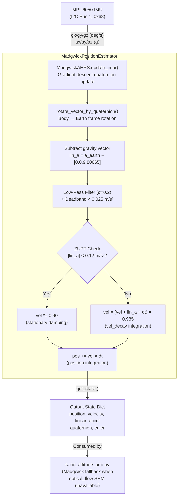

# Review: `madgwick_ahrs.py`

**File:** [`madgwick_ahrs.py`](file:///e:/OptFlowDrone/OpticalFlowDrone/madgwick_ahrs.py)
**Role in System:** AHRS attitude estimation and 3D position/velocity integration module, imported exclusively by [`send_attitude_udp.py`](file:///e:/OptFlowDrone/OpticalFlowDrone/send_attitude_udp.py).

---

## Overview

This module implements two classes:

| Class | Purpose |
|---|---|
| `MadgwickAHRS` | 6-DOF orientation filter — maintains a unit quaternion fused from gyroscope and accelerometer input |
| `MadgwickPositionEstimator` | Wraps `MadgwickAHRS` and adds Earth-frame linear acceleration extraction, ZUPT, and double-integration for 3D position/velocity |

**Reference:**
> Sebastian O.H. Madgwick, _"An efficient orientation filter for inertial and inertial/magnetic sensor arrays"_, Report x-io and University of Bristol, 2010.

---

## Class 1: `MadgwickAHRS`

### Purpose
A 6-DOF (no magnetometer) gradient descent orientation filter. It maintains a unit quaternion `q = [qw, qx, qy, qz]` representing the sensor body frame orientation relative to the Earth frame.

### Constructor Parameters

| Parameter | Default | Description |
|---|---|---|
| `beta` | `0.1` | Filter gain — controls how aggressively the accelerometer corrects gyro drift. Higher = more responsive but noisier. Lower = smoother but slower to correct. |
| `sample_freq` | `50.0` | Default sampling frequency in Hz. Used as fallback `dt` when timestamps are unavailable. |

### Internal State

| Attribute | Description |
|---|---|
| `self.q` | Quaternion `[qw, qx, qy, qz]`, initialized to identity `[1, 0, 0, 0]` |
| `self.last_update_ts` | Timestamp of the last `update_imu()` call, used to auto-compute `dt` |

### Key Methods

#### `update_imu(gx_dps, gy_dps, gz_dps, ax_g, ay_g, az_g, dt=None)`
Main update step. Accepts gyroscope (deg/s) and accelerometer (g) readings and applies the Madgwick gradient descent step.

**Algorithm steps:**
1. Convert gyroscope rates from deg/s → rad/s.
2. Compute quaternion rate of change from gyroscope: `qDot = 0.5 * q ⊗ ω`
3. If accelerometer norm > 0 (valid signal):
   - Normalize accelerometer vector.
   - Compute objective function `f(q, a)` = difference between predicted and measured gravity direction in quaternion form.
   - Compute Jacobian transpose `Jᵀ · f` as gradient `s`.
   - Normalize gradient and subtract: `qDot -= beta * s_normalized`
4. Integrate: `q += qDot * dt`
5. Normalize final quaternion to unit length.

**Guard rails:**
- `dt` is clamped to `[0, 0.5]` seconds; out-of-range values fall back to `1/sample_freq`.
- Accelerometer feedback is skipped if `|a| < 1e-4` (zero-gravity guard).
- Gradient normalization is skipped if `|s| < 1e-8` (near-zero guard).

#### `get_quaternion()`
Returns `{"w": qw, "x": qx, "y": qy, "z": qz}`.

#### `get_euler_deg()`
Converts current quaternion to Euler angles using Z-Y-X convention:

| Angle | Formula |
|---|---|
| Roll (φ) | `atan2(2(qw·qx + qy·qz), 1 − 2(qx² + qy²))` |
| Pitch (θ) | `arcsin(2(qw·qy − qz·qx))` — clamped for gimbal lock at ±90° |
| Yaw (ψ) | `atan2(2(qw·qz + qx·qy), 1 − 2(qy² + qz²))` |

Returns `(roll_deg, pitch_deg, yaw_deg)`.

#### `reset()`
Resets quaternion to identity `[1, 0, 0, 0]` and clears timestamp.

---

## Class 2: `MadgwickPositionEstimator`

### Purpose
Extends `MadgwickAHRS` with Earth-frame linear acceleration extraction, low-pass filtering, ZUPT (Zero Velocity Update), and drift-compensated double integration to produce a 3D position and velocity estimate.

### Constructor Parameters

| Parameter | Default | Description |
|---|---|---|
| `beta` | `0.1` | Passed to `MadgwickAHRS` filter gain |
| `sample_freq` | `50.0` | Default sampling frequency in Hz |
| `gravity_m_s2` | `9.80665` | Gravity constant used to convert accel from g to m/s² |
| `vel_decay` | `0.985` | Exponential decay factor applied to velocity each step to prevent runaway integration drift |
| `zupt_threshold` | `0.12` | Linear accel norm (m/s²) below which ZUPT dampening is applied (drone is considered stationary) |

### Internal State

| Attribute | Units | Description |
|---|---|---|
| `self.pos` | meters | `[x, y, z]` 3D position relative to start |
| `self.vel` | m/s | `[vx, vy, vz]` 3D velocity in Earth frame |
| `self.lin_accel_earth` | m/s² | Raw Earth-frame linear acceleration (gravity removed) |
| `self.lin_accel_filtered` | m/s² | Low-pass filtered version (alpha = 0.2) |

### Key Methods

#### `update(gx_dps, gy_dps, gz_dps, ax_g, ay_g, az_g, dt=None)`
Full update step — combines AHRS orientation + position integration in 6 stages:

```
Step 1: Update MadgwickAHRS → new quaternion q
Step 2: Convert accel from g → m/s²:  a_body = a_g × 9.80665
Step 3: Rotate body acceleration to Earth frame via quaternion: a_earth = q ⊗ a_body ⊗ q*
Step 4: Remove gravity: lin_a = a_earth − [0, 0, g]
Step 5: Low-pass filter (α=0.2) + deadband (< 0.025 m/s²)
        ZUPT check:
          |lin_a| < zupt_threshold → vel *= 0.90  (stationary damping)
          else → vel = (vel + lin_a × dt) × vel_decay
Step 6: pos += vel × dt
```

Returns the full state dictionary from `get_state()`.

#### `rotate_vector_by_quaternion(vx, vy, vz, q)`
Performs quaternion sandwich product `v_earth = q · v_body · q*` to rotate a 3D vector from the sensor body frame into the Earth (NED/ENU) frame.

#### `get_state()`
Returns the complete telemetry state dictionary:

```json
{
  "position": { "x": 0.0, "y": 0.0, "z": 0.0 },
  "velocity": { "x": 0.0, "y": 0.0, "z": 0.0 },
  "linear_accel": { "x": 0.0, "y": 0.0, "z": 0.0 },
  "quaternion": { "w": 1.0, "x": 0.0, "y": 0.0, "z": 0.0 },
  "euler": { "roll": 0.0, "pitch": 0.0, "yaw": 0.0 }
}
```

#### `reset_position()`
Zeros `pos`, `vel`, `lin_accel_earth`, and `lin_accel_filtered`.

#### `reset_all()`
Calls `reset_position()` and resets the underlying `MadgwickAHRS` quaternion to identity.

---

## Data Flow Diagram



---

## How It Is Used in `send_attitude_udp.py`

```python
from madgwick_ahrs import MadgwickPositionEstimator

madgwick_estimator = MadgwickPositionEstimator(beta=0.1, sample_freq=50.0)

# Called at 50 Hz in the main telemetry loop:
m_state = madgwick_estimator.update(
    gx_dps=gx, gy_dps=gy, gz_dps=gz,
    ax_g=ax_g, ay_g=ay_g, az_g=az_g
)

# m_state position used as FALLBACK if optical_flow SHM is unavailable:
pos_x = flow["x_m"] if flow else m_state["position"]["x"]
pos_y = flow["y_m"] if flow else m_state["position"]["y"]
pos_z = -flow["z_m"] if flow else -m_state["position"]["z"]

# m_state quaternion always sent in UDP telemetry packet:
telemetry_packet["rotation"]["quaternion"] = m_state["quaternion"]
telemetry_packet["translation"]["linear_accel"] = m_state["linear_accel"]
```

> [!NOTE]
> The Madgwick position/velocity estimate acts as a **fallback** only. When the `optical_flow_stream` shared memory segment has valid data, the optical flow X/Y position and velocities override the Madgwick-derived ones. The **quaternion and linear_accel** from Madgwick are always included in the UDP telemetry packet regardless.

---

## Parameter Tuning Guide

| Parameter | Effect of Increasing | Effect of Decreasing |
|---|---|---|
| `beta` | Faster convergence, more accelerometer-responsive, noisier attitude | Smoother attitude, slower to correct gyro drift |
| `vel_decay` | Less drift suppression, position drifts further | More aggressive drift control, underestimates velocity |
| `zupt_threshold` | ZUPT triggers more often, better at suppressing drift when hovering | ZUPT triggers less, integrates more small noise into drift |

> [!TIP]
> For a hover-heavy drone, keep `zupt_threshold` between `0.08`–`0.15` and `vel_decay` between `0.98`–`0.99`. Lower `beta` (e.g., `0.05`) gives smoother attitude but requires the gyro to have low drift characteristics.

---

## Relationship to `sensor_fusion.py`

Both modules are used together in `send_attitude_udp.py`. They serve different roles:

| Aspect | `MadgwickPositionEstimator` | `SensorFusionEngine` |
|---|---|---|
| **Primary job** | Quaternion attitude + IMU-only 3D position fallback | GPS-corrected 2D fused position at 50 Hz |
| **Inputs** | Gyro (deg/s), Accel (g) | Optical flow velocity, Compass heading, GPS lat/lon |
| **Drift correction** | Velocity decay + ZUPT | GPS innovation residual correction |
| **Output position** | 3D meters from start (IMU dead-reckoning) | Fused WGS-84 lat/lon + local plane meters |
| **Update rate** | 50 Hz | 50 Hz predict, 1–5 Hz GPS correct |
| **Used in telemetry** | `quaternion`, `linear_accel` always; `position/velocity` as fallback | `fused_gps` field always |
